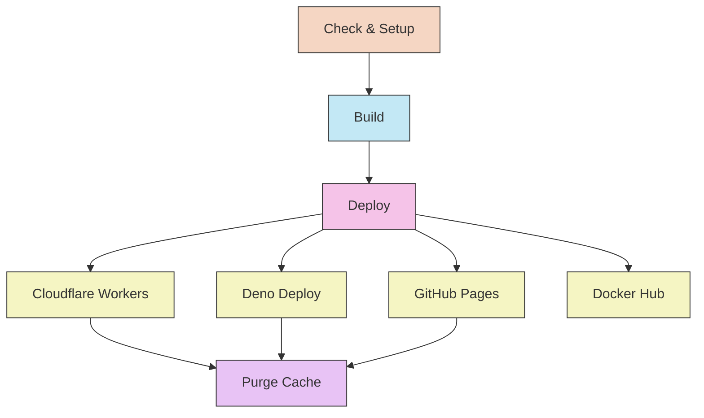

# CI/CD Implementation

### Continuous Integration/Deployment for the Revista project

---

## Overview

This project uses GitHub Actions for its CI/CD pipeline, automating builds and deployments to multiple targets including Cloudflare Workers, Deno Deploy, GitHub Pages, and Docker Hub. The pipeline is optimized for speed with parallel deployments and smart caching strategies.

## Workflow Architecture

The CI/CD pipeline consists of the following stages:



## Workflow File Structure

The primary workflow file is `.github/workflows/deploy.yml`, which orchestrates the entire process.

## Build Process

The build process supports multiple deployment targets with different configurations:

### Standard Build (Shared by Workers, Deno, Docker)

```yaml
jobs:
  build-revista:
    runs-on: ubuntu-latest
    steps:
      - uses: actions/checkout@v4

      - name: Setup Bun
        uses: oven-sh/setup-bun@v1

      - name: Cache dependencies
        uses: actions/cache@v4
        with:
          path: |
            ~/.bun/install/cache
            node_modules
            .astro
            dist
          key: ${{ runner.os }}-bun-${{ hashFiles('**/bun.lock', '**/package.json', 'astro.config.mjs', 'tailwind.config.mjs') }}
          restore-keys: |
            ${{ runner.os }}-bun-${{ hashFiles('**/bun.lock', '**/package.json') }}-
            ${{ runner.os }}-bun-

      - name: Install dependencies
        run: bun install

      - name: Build site
        run: bun run build

      - name: Upload artifact
        uses: actions/upload-artifact@v4
        with:
          name: dist
          path: dist/
```

### GitHub Pages Build (Independent)

GitHub Pages uses its own build process to accommodate the different base path requirement:

```bash
# Environment variable sets GitHub Pages configuration
GITHUB_PAGES=true astro build && pagefind --site dist
```

This approach ensures:

- **Standard deployments** use `site: "https://www.erfianugrah.com"` with no base path
- **GitHub Pages** uses `site: "https://erfianugrah.github.io"` with `base: "/revista-3"`
- **Complete isolation** between deployment configurations

Key optimizations:

1. **Bun Instead of Node**: Uses Bun for significantly faster installations and builds
2. **Smart Dependency Caching**: Only invalidates cache when dependencies or config files change (not on every source change)
3. **Config-Based Cache Keys**: Includes `astro.config.mjs` and `tailwind.config.mjs` for precise invalidation
4. **Artifact Generation**: Uploads the build output for use in subsequent jobs
5. **Build Retry Logic**: Automatically retries failed builds up to 3 times

## Deployment Targets

### Cloudflare Workers (with Static Assets)

```yaml
deploy-to-cloudflare-workers:
  needs: build-revista
  runs-on: ubuntu-latest
  steps:
    - name: Checkout
      uses: actions/checkout@v4

    - name: Download built artifacts
      uses: actions/download-artifact@v4
      with:
        name: dist
        path: dist

    - name: Deploy to Cloudflare Workers
      uses: cloudflare/wrangler-action@v3
      with:
        apiToken: ${{ secrets.CLOUDFLARE_WRANGLER_TOKEN }}
        accountId: ${{ secrets.CLOUDFLARE_ACCOUNT_ID }}
        command: deploy
        packageManager: bun
```

Key points:

1. Uses Cloudflare Workers with Static Assets (not Pages)
2. Configured via `wrangler.jsonc` in repository root
3. Supports future hybrid SSR + static capabilities
4. Deploys to `revista.workers.dev` subdomain
5. Cache purge runs separately after all web deployments complete

### Deno Deploy

```yaml
deploy-deno:
  needs: test
  runs-on: ubuntu-latest
  steps:
    - name: Download build
      uses: actions/download-artifact@v3
      with:
        name: build-output
        path: dist

    - name: Deploy to Deno Deploy
      uses: denoland/deployctl@v1
      with:
        project: revista
        entrypoint: https://deno.land/std/http/file_server.ts
        root: dist
        token: ${{ secrets.DENO_DEPLOY_TOKEN }}
```

This provides a secondary deployment target using Deno's edge platform.

### GitHub Pages

```yaml
deploy-to-github-pages:
  runs-on: ubuntu-latest
  permissions:
    contents: read
    pages: write
    id-token: write
  concurrency:
    group: "pages"
    cancel-in-progress: false
  environment:
    name: github-pages
    url: ${{ steps.deployment.outputs.page_url }}
  steps:
    - name: Checkout repository
      uses: actions/checkout@v4

    - name: Setup Bun environment
      uses: oven-sh/setup-bun@v1

    - name: Cache dependencies
      uses: actions/cache@v4
      with:
        path: |
          ~/.bun/install/cache
          node_modules
        key: ${{ runner.os }}-bun-${{ hashFiles('**/bun.lock') }}-${{ hashFiles('**/package.json') }}
        restore-keys: |
          ${{ runner.os }}-bun-${{ hashFiles('**/bun.lock') }}-
          ${{ runner.os }}-bun-

    - name: Install project dependencies
      run: bun install

    - name: Build for GitHub Pages
      run: bun run build:github-pages

    - name: Setup Pages
      uses: actions/configure-pages@v5

    - name: Upload to GitHub Pages
      uses: actions/upload-pages-artifact@v3
      with:
        path: dist

    - name: Deploy to GitHub Pages
      id: deployment
      uses: actions/deploy-pages@v4
```

Key features:

1. **Independent Build Process**: Unlike other deployments, GitHub Pages builds from source with its own environment
2. **Environment-Specific Configuration**: Uses `GITHUB_PAGES=true` environment variable to set correct `site` and `base` paths
3. **Dedicated Build Command**: Uses `build:github-pages` npm script for proper base path configuration
4. **Proper Permissions**: Configures Pages write access and OIDC token authentication
5. **Concurrency Control**: Prevents conflicting deployments with proper job isolation
6. **Latest GitHub Actions**: Uses official Pages Actions (configure-pages@v5, upload-pages-artifact@v3, deploy-pages@v4)

### Docker Deployment

```yaml
build-and-push-docker:
  needs: build-revista
  runs-on: ubuntu-latest
  outputs:
    digest: ${{ steps.build.outputs.digest }}
    tags: ${{ steps.meta.outputs.tags }}
  steps:
    - name: Checkout repository
      uses: actions/checkout@v4
      with:
        sparse-checkout: |
          Dockerfile
          Caddyfile

    - name: Download build artifacts
      uses: actions/download-artifact@v4
      with:
        name: dist
        path: dist

    - name: Docker metadata
      id: meta
      uses: docker/metadata-action@v5
      with:
        images: erfianugrah/revista-4
        tags: |
          type=ref,event=branch
          type=ref,event=pr
          type=semver,pattern={{version}}
          type=semver,pattern={{major}}.{{minor}}
          type=semver,pattern={{major}}
          type=sha,prefix={{branch}}-
          type=raw,value=latest,enable={{is_default_branch}}

    - name: Build and push Docker image
      id: build
      uses: docker/build-push-action@v6
      with:
        context: .
        platforms: linux/amd64,linux/arm64,linux/arm/v6,linux/arm/v7
        push: true
        tags: ${{ steps.meta.outputs.tags }}
        labels: ${{ steps.meta.outputs.labels }}
        cache-from: type=gha
        cache-to: type=gha,mode=max
        provenance: true
        sbom: true
```

Key aspects:

1. **Modern Semantic Versioning**: Uses `docker/metadata-action` for automatic tag generation from GitHub releases
2. **Multi-Architecture Builds**: Supports AMD64, ARM64, ARMv6, and ARMv7 platforms
3. **Sparse Checkout**: Only checks out required files (Dockerfile, Caddyfile) for faster builds
4. **Security Features**: Includes Cosign signing, SBOM, and provenance attestations
5. **GitHub Actions Cache**: Leverages GHA cache for faster subsequent builds
6. **Automatic Tagging**: Creates multiple tags from a single release (e.g., `v1.2.3` → `1.2.3`, `1.2`, `1`, `latest`)

#### Docker Versioning

When you create a GitHub release with tag `v1.2.3`, the workflow automatically creates:

- `erfianugrah/revista-4:1.2.3` (full version)
- `erfianugrah/revista-4:1.2` (major.minor)
- `erfianugrah/revista-4:1` (major)
- `erfianugrah/revista-4:latest` (if on main branch)
- `erfianugrah/revista-4:main-<sha>` (commit SHA for tracking)

All images are signed with Cosign for supply chain security.

## Secret Management

The workflow uses GitHub Secrets for sensitive information:

- `CLOUDFLARE_WRANGLER_TOKEN` - Authentication for Cloudflare Workers deployment
- `CLOUDFLARE_ACCOUNT_ID` - Cloudflare account identifier
- `CLOUDFLARE_ZONE_ID` - Cloudflare zone for cache purging
- `CLOUDFLARE_CACHE_PURGE_TOKEN` - Token for purging Cloudflare cache
- `CLOUDFLARE_ZONE_NAME` - Primary domain name (e.g., erfianugrah.com)
- `CLOUDFLARE_WWW` - WWW variant domain (e.g., www.erfianugrah.com)
- `DOCKER_USERNAME` - Docker Hub account username
- `DOCKER_REGISTRY_TOKEN` - Authentication token for Docker Hub

**GitHub Pages Specific:**

- No additional secrets required (uses built-in OIDC with `id-token: write`)
- Environment variable `GITHUB_PAGES=true` automatically set during GitHub Pages build

**Note:** Deno Deploy authentication is handled via OIDC (no token required).

## Workflow Triggers

The workflow runs automatically on:

```yaml
on:
  push:
    branches: [main]
  pull_request:
    branches: [main]
  release:
    types: [published]
```

This ensures:

1. **Push to main**: Automatic deployment of latest changes to all targets
2. **Pull Requests**: Build verification for PRs (no deployment)
3. **GitHub Releases**: Triggers semantic versioning for Docker images (e.g., `v1.2.3` → multiple tags)

## Retry Logic and Error Handling

The build job includes built-in retry logic for transient errors:

```yaml
- name: Build project with retry
  env:
    MAX_ATTEMPTS: 3
    RETRY_INTERVAL: 30
  run: |
    attempt=1
    until bun run build || [ $attempt -eq $MAX_ATTEMPTS ]; do
      echo "Build attempt $attempt failed. Retrying in $RETRY_INTERVAL seconds..."
      sleep $RETRY_INTERVAL
      attempt=$((attempt + 1))
    done
```

This improves reliability by automatically retrying build operations that might fail due to temporary issues.

## Performance Considerations

The CI/CD pipeline is optimized for speed through multiple strategies:

### Optimization Strategies

1. **Smart Caching**: Cache keys only invalidate on actual dependency/config changes (not on every source file change)
2. **Parallel Deployments**: Web deployments (Workers, Deno, Pages) run simultaneously
3. **Decoupled Docker Pipeline**: Docker build runs in parallel and doesn't block web deployments
4. **Sparse Checkouts**: Docker job only checks out required files (Dockerfile, Caddyfile)
5. **Artifact Sharing**: Build once, deploy to multiple targets from shared artifact
6. **Bun Runtime**: Significantly faster than npm for installation and building
7. **GitHub Actions Cache**: Leverages GHA cache for Docker layers and dependencies

### Pipeline Timing

**Critical Path (Web Deployments):**

```
build-revista:              ~2 min (optimized caching)
  ├─ deploy-to-workers:     ~1 min
  ├─ deploy-to-deno:        ~1 min
  └─ deploy-to-github-pages: ~3 min (independent build)
      └─ purge-cache:       ~5 sec
─────────────────────────────────────
Total critical path:        ~5 min ⚡
```

**Docker Pipeline (Parallel, Non-Blocking):**

```
build-revista:              ~2 min
  └─ build-and-push-docker: ~8-10 min (4 platforms)
      └─ inspect-image:     ~10 sec
          └─ sign-image:    ~2 min (Cosign)
─────────────────────────────────────
Total Docker path:          ~12 min (parallel)
```

**Key Performance Improvements:**

- **Users see updates:** ~5 minutes after push (previously ~12-15 min)
- **Cache purges:** Immediately after web deployments (doesn't wait for Docker)
- **Docker images:** Build in background without blocking users
- **Overall speedup:** 3x faster for critical web deployment path
