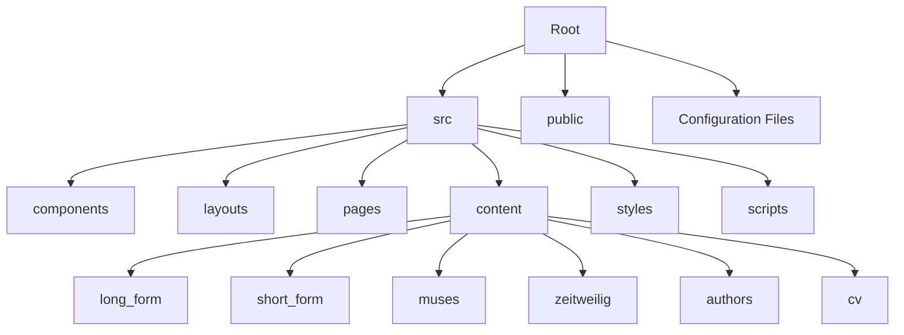
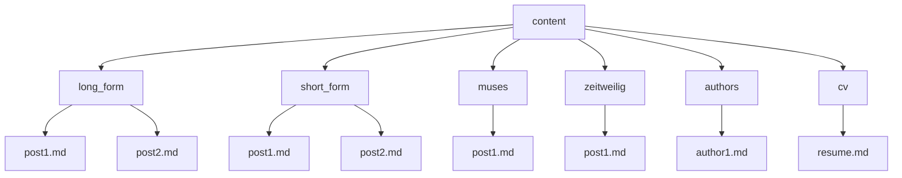

## Overview

Revista is a photography portfolio and blog built using the Astro framework. It showcases various collections of photographs and written content, organized into different categories such as long-form, short-form, muses, and zeitweilig.

## Project Structure



### Key Directories and Files

- `src/`: Contains the main source code for the site
  - `components/`: Reusable Astro components
  - `layouts/`: Page layouts used across the site
  - `pages/`: Astro pages that generate routes
  - `content/`: Markdown content for blog posts and collections
  - `styles/`: CSS files for styling
  - `scripts/`: JavaScript files for client-side functionality
- `public/`: Static assets like images and fonts
- Configuration files: `astro.config.mjs`, `tailwind.config.mjs`, `tsconfig.json`, etc.

## Key Features

1. **Multiple Content Collections**: The site is organized into different content types (long_form, short_form, muses, zeitweilig, authors).
2. **Responsive Design**: Utilizes Tailwind CSS for a mobile-first, responsive layout.
3. **Dark Mode**: Supports both light and dark themes.
4. **Dynamic Routing**: Generates routes based on content collections.
5. **RSS Feeds**: Provides RSS feeds for each content collection.
6. **SEO Optimized**: Includes metadata and structured data for better search engine visibility.
7. **Performance Optimized**: Uses Astro's static site generation for fast loading times.
8. **Interactive Components**: Incorporates client-side JavaScript for enhanced user experience.

## Content Management

Content is managed through Markdown files located in the `src/content/` directory. Each content type (e.g., long_form, short_form) has its own subdirectory.



## Routing

Routing in this Astro project is handled through a combination of file-based routing and dynamic route generation. Here's a detailed breakdown:

### File-based Routing

Astro uses a file-based routing system. Files in the `src/pages` directory automatically become routes based on their file name.

```mermaid
graph TD
    A[src/pages] --> B[index.astro]
    A --> C[404.astro]
    A --> D[authors.astro]
    A --> E[cv.astro]
    A --> F[long_form directory]
    A --> G[short_form directory]
    A --> H[muses directory]
    A --> I[zeitweilig directory]
    F --> J[index.astro]
    F --> K[...slug.astro]
    F --> L[tags directory]
    L --> M[index.astro]
    L --> N[[tag].astro]
```

- `index.astro` becomes the home page (/)
- `404.astro` is the custom 404 error page
- `authors.astro`, `cv.astro`, etc., become their respective routes

### Dynamic Routing

For content collections (long_form, short_form, muses, zeitweilig), dynamic routing is used:

1. **Collection Index Pages**: 
   - File: `src/pages/[collection]/index.astro`
   - Route: `/long_form`, `/short_form`, etc.
   - These pages list all posts in a collection.

2. **Individual Post Pages**:
   - File: `src/pages/[collection]/[...slug].astro`
   - Route: `/long_form/post-slug`, `/short_form/post-slug`, etc.
   - The `getStaticPaths` function generates routes for each post in the collection.

3. **Tag Index Pages**:
   - File: `src/pages/[collection]/tags/index.astro`
   - Route: `/long_form/tags`, `/short_form/tags`, etc.
   - Lists all tags used in a collection.

4. **Tag Detail Pages**:
   - File: `src/pages/[collection]/tags/[tag].astro`
   - Route: `/long_form/tags/nature`, `/short_form/tags/city`, etc.
   - The `getStaticPaths` function generates routes for each unique tag in the collection.

### RSS Feeds

RSS feeds are generated dynamically for each collection:

- File: `src/pages/[collection]/rss.xml.js`
- Route: `/long_form/rss.xml`, `/short_form/rss.xml`, etc.

### Routing Logic

1. When a request comes in, Astro first checks for a matching file in `src/pages`.
2. For dynamic routes (like `[...slug].astro`), Astro uses the `getStaticPaths` function to generate all possible paths at build time.
3. If no match is found, the 404 page is served.

## Styling

The project uses Tailwind CSS for styling, with custom configurations in `tailwind.config.mjs`. Additional styles are defined in `src/styles/`.

## Scripts

Client-side functionality is handled by JavaScript files in the `src/scripts/` directory, including:

- Dark mode toggle
- Image lightbox
- Random quote generator (for 404 page)
- RSS feed handling

## CI/CD Workflow

This project uses GitHub Actions for continuous integration and deployment. The workflow is defined in `.github/workflows/deploy.yml`.

### Workflow Steps:

1. **Build Revista**:
   - Checks out the repository
   - Sets up the Bun environment
   - Caches dependencies and build artifacts
   - Installs project dependencies
   - Builds the project with retry logic

2. **Deploy to Deno**:
   - Downloads build artifacts
   - Sets up Deno
   - Deploys to Deno using `deployctl`

3. **Deploy to Cloudflare**:
   - Downloads build artifacts
   - Deploys to Cloudflare Pages using Wrangler

4. **Prepare Docker**:
   - Determines version increment type based on commit message
   - Generates a new version tag

5. **Build and Push Docker Image**:
   - Sets up QEMU and Docker Buildx
   - Logs in to Docker Hub
   - Builds and pushes a multi-architecture Docker image

6. **Inspect Docker Image**:
   - Inspects the built Docker image

7. **Sign Docker Image**:
   - Installs Cosign
   - Signs the Docker image
   - Verifies the Docker image signature

8. **Purge Cloudflare Cache**:
   - Purges the Cloudflare cache after successful deployment

This workflow ensures that every push to the main branch triggers a build, test, and deployment process, keeping the live site up-to-date with the latest changes.

## Docker Setup

The project includes a Dockerfile for containerization. Here's an overview of the Docker setup:

```dockerfile
FROM caddy:2.8.4-alpine

WORKDIR /usr/share/caddy

COPY ./dist .
COPY Caddyfile /etc/caddy/Caddyfile

RUN chown -R root:root /usr/share/caddy && \
    chmod -R 755 /usr/share/caddy

EXPOSE 80

CMD ["caddy", "run", "--config", "/etc/caddy/Caddyfile", "--adapter", "caddyfile"]
```

This Dockerfile:
1. Uses Caddy as the base image
2. Sets the working directory
3. Copies the built Astro site and Caddyfile
4. Sets appropriate permissions
5. Exposes port 80
6. Starts Caddy with the provided configuration

The Docker image is built and pushed as part of the CI/CD workflow, creating a containerized version of the site that can be easily deployed to various container hosting platforms.

## Getting Started

To get started with this project, follow these steps:

1. Clone the repository:
   ```
   git clone https://github.com/your-username/revista.git
   cd revista
   ```

2. Install dependencies using Bun:
   ```
   bun install
   ```

3. Run the development server:
   ```
   bun run dev
   ```

4. Build for production:
   ```
   bun run build
   ```

5. Preview the production build:
   ```
   bun run preview
   ```

Make sure you have Bun installed on your system before running these commands. You can install Bun by following the instructions on the [official Bun website](https://bun.sh/).

## Contributing

Contributions are welcome! Please read the contributing guidelines before submitting pull requests.

## License

This project is licensed under the MIT License - see the [LICENSE](LICENSE) file for details.

**Note:** The blog content (posts, articles, images, etc.) is not covered by the MIT License. All rights to the content are reserved by the respective authors unless otherwise specified.
