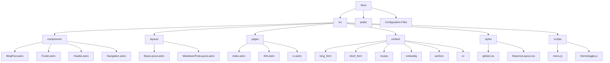
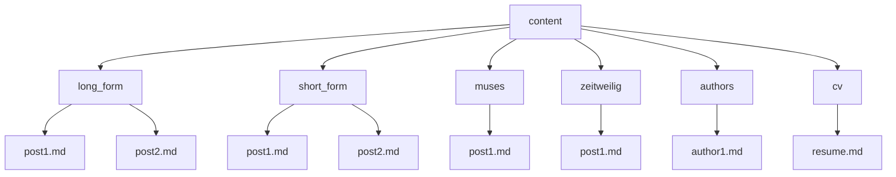
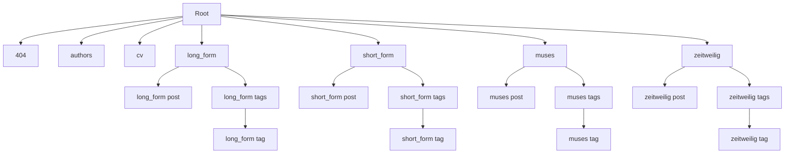

<p>
  
</p>

## Overview

Revista is a sophisticated photography portfolio and blog built using the Astro framework. It showcases various collections of photographs and written content, organized into different categories such as long-form, short-form, muses, and zeitweilig. The project emphasizes performance, aesthetic presentation, and efficient content management.

## Project Structure



### Key Directories and Files

- `src/`: Contains the main source code for the site
  - `components/`: Reusable Astro components
    - `BlogPost.astro`: Component for rendering individual blog post previews
    - `Footer.astro`: Site-wide footer component
    - `Header.astro`: Site-wide header component
    - `Navigation.astro`: Navigation menu component
  - `layouts/`: Page layouts used across the site
    - `BaseLayout.astro`: The main layout used by most pages
    - `MarkdownPostLayout.astro`: Layout for rendering Markdown content
  - `pages/`: Astro pages that generate routes
    - `index.astro`: The home page
    - `404.astro`: Custom 404 error page
    - `cv.astro`: CV page
  - `content/`: Markdown content for blog posts and collections
  - `styles/`: CSS files for styling
    - `global.css`: Global styles and Tailwind imports
    - `MasonryLayout.css`: Styles for the masonry layout used in galleries
  - `scripts/`: JavaScript files for client-side functionality
    - `menu.js`: Handles mobile menu functionality
    - `themetoggle.js`: Manages dark/light theme toggling
- `public/`: Static assets like images and fonts
- Configuration files:
  - `astro.config.mjs`: Astro configuration
  - `tailwind.config.mjs`: Tailwind CSS configuration
  - `tsconfig.json`: TypeScript configuration

## Key Features

1. **Multiple Content Collections**: The site is organized into different content types (long_form, short_form, muses, zeitweilig, authors), each managed as an Astro content collection. This allows for type-safe content management and easy querying.

2. **Responsive Design**: Utilizes Tailwind CSS for a mobile-first, responsive layout. The design adapts seamlessly from mobile devices to large desktop screens.

3. **Dark Mode**: Supports both light and dark themes, with a toggle functionality implemented in `themetoggle.js`. The theme preference is stored in localStorage for persistence across visits.

4. **Dynamic Routing**: Generates routes based on content collections. This includes dynamic routes for individual posts and tag pages.

5. **RSS Feeds**: Provides RSS feeds for each content collection, allowing users to subscribe to updates. The feeds are generated dynamically using `@astrojs/rss`.

6. **SEO Optimized**: Includes metadata and structured data for better search engine visibility. Each page has customizable meta tags for title, description, and Open Graph data.

7. **Performance Optimized**: Uses Astro's static site generation for fast loading times. Additionally, implements lazy loading for images and prefetching for improved navigation performance.

8. **Interactive Components**: Incorporates client-side JavaScript for enhanced user experience, including a mobile menu, theme toggle, and image lightbox functionality.

9. **Custom 404 Page**: Features a unique 404 error page with quotes from Ron Burgundy, adding a touch of humor to the user experience when encountering missing pages.

10. **CV Section**: Includes a dedicated CV page, demonstrating the versatility of the platform for personal branding and professional presentation.

## Content Management

Content is managed through Markdown files located in the `src/content/` directory. Each content type (e.g., long_form, short_form) has its own subdirectory.



Each Markdown file contains frontmatter with metadata such as title, publication date, tags, and image information. The content collections are defined in `src/content/config.ts`, which specifies the schema for each collection using Zod for runtime type checking.

## Routing

Routing in this Astro project is handled through a combination of file-based routing and dynamic route generation. Here's a simplified overview of the route structure:



### Route Explanation:

1. **Root and Static Routes**:
   - `/`: Home page (`src/pages/index.astro`)
   - `/404`: Custom 404 error page (`src/pages/404.astro`)
   - `/authors`: Authors page (`src/pages/authors.astro`)
   - `/cv`: CV page (`src/pages/cv.astro`)

2. **Collection Routes**:
   For each collection (long_form, short_form, muses, zeitweilig):
   - `/{collection}`: Index page for the collection (`src/pages/{collection}/index.astro`)
   - `/{collection}/post-slug`: Individual post pages (`src/pages/{collection}/[...slug].astro`)
   - `/{collection}/tags`: Tag index for the collection (`src/pages/{collection}/tags/index.astro`)
   - `/{collection}/tags/tag-name`: Pages for specific tags (`src/pages/{collection}/tags/[tag].astro`)

3. **Dynamic Route Generation**:
   - Post pages (e.g., `/long_form/post-slug`) are generated dynamically based on the content in the respective collection using `getStaticPaths()` in `[...slug].astro`.
   - Tag pages (e.g., `/long_form/tags/tag-name`) are generated for each unique tag used in the collection, also using `getStaticPaths()` in `[tag].astro`.

4. **RSS Feeds**:
   - Each collection has an RSS feed available at `/{collection}/rss.xml`, generated by `rss.xml.js` files in each collection's directory.

This routing structure is implemented through a combination of static files in the `src/pages` directory and dynamic route generation using Astro's `getStaticPaths` function in the respective page components.

## Styling

The project uses Tailwind CSS for styling, with custom configurations in `tailwind.config.mjs`. Key styling features include:

1. **Custom Font Configuration**: Uses "Overpass Mono Variable" and "Inconsolata Variable" fonts, configured in the Tailwind theme.

2. **Custom Utilities**: Defines custom utilities for object positioning and background sizing.

3. **Typography Plugin**: Utilizes `@tailwindcss/typography` plugin for rich text styling.

4. **Dark Mode**: Configured to use the `class` strategy for dark mode, allowing for dynamic theme switching.

5. **Custom Breakpoints**: Defines custom breakpoints for responsive design (sm: 800px, md: 1200px, lg: 1900px, xl: 2500px, 2xl: 3800px).

Additional styles are defined in `src/styles/`:

- `global.css`: Contains global styles and Tailwind directives.
- `MasonryLayout.css`: Defines styles for the masonry layout used in image galleries.

## Scripts

Client-side functionality is handled by JavaScript files in the `src/scripts/` directory, including:

- `themetoggle.js`: Manages dark/light theme toggling and persistence.
- `menu.js`: Handles the mobile navigation menu toggle.
- `lightbox.js`: Implements a lightbox feature for image galleries using GLightbox.
- `burgundy.js`: Generates random Ron Burgundy quotes for the 404 page.
- `rss.js`: Manages visibility of RSS links based on the current page.
- `homePage.js`: Handles random image selection for the homepage.

## Performance Optimization

The project implements several performance optimization techniques:

1. **Image Optimization**: Uses Astro's `getImage` function to optimize images, converting them to the AVIF format and setting appropriate dimensions.

2. **Lazy Loading**: Images are set to load lazily using the `loading="lazy"` attribute, improving initial page load times.

3. **Preloading and Prefetching**: Utilizes Astro's `prefetch` feature to improve navigation performance between pages.

4. **Efficient Bundling**: Astro's built-in bundling and tree-shaking ensure only necessary code is sent to the client.

5. **Caching Strategy**: Implements caching headers and Cloudflare's CDN for improved content delivery speed.

## Search Functionality

The project implements a search feature using Pagefind, allowing users to search through the site's content easily. The search component is integrated into the `Navigation.astro` component.

## Internationalization

While the primary language is English, the project structure supports potential multilingual content:

1. The RSS feeds are set up with language tags (`<language>en-us</language>`).
2. The content structure allows for easy addition of localized content in the future.

## External Integrations

1. **Cloudflare**: 
   - Used for hosting and CDN services.
   - Cache purging is implemented in the CI/CD pipeline to ensure fresh content delivery.

2. **Deno Deploy**: 
   - Serves as an additional deployment target.
   - Demonstrates the project's versatility in hosting options.

## Development Tools

1. **Bun**: 
   - Used as the JavaScript runtime and package manager.
   - Offers improved performance over traditional Node.js and npm.
   - All scripts in `package.json` are run using Bun.

2. **TypeScript**: 
   - The project includes TypeScript configurations (`tsconfig.json`).
   - Enables type-safe development practices.

3. **Prettier**: 
   - Used for code formatting, ensuring consistent code style across the project.

4. **ESLint**: 
   - While not explicitly configured, the project structure suggests its potential use for code linting.

## CI/CD Workflow

The project uses GitHub Actions for continuous integration and deployment, defined in `.github/workflows/deploy.yml`. Key steps include:

1. **Build Revista**:
   - Uses Bun for dependency installation and build process.
   - Implements caching for faster builds.
   - Includes retry logic for build reliability.

2. **Deploy to Deno**:
   - Utilizes Deno Deploy for hosting.

3. **Deploy to Cloudflare**:
   - Deploys to Cloudflare Pages using Wrangler.

4. **Docker Image Handling**:
   - Builds a multi-architecture Docker image.
   - Pushes the image to Docker Hub.
   - Signs the Docker image using Cosign for security.

5. **Cache Management**:
   - Purges Cloudflare cache after successful deployment.

## Docker Setup

The project includes a Dockerfile for containerization:

```dockerfile
FROM caddy:2.8.4-alpine

WORKDIR /usr/share/caddy

COPY ./dist .
COPY Caddyfile /etc/caddy/Caddyfile

RUN chown -R root:root /usr/share/caddy && \
    chmod -R 755 /usr/share/caddy

EXPOSE 80

CMD ["caddy", "run", "--config", "/etc/caddy/Caddyfile", "--adapter", "caddyfile"]
```

This setup:
1. Uses Caddy as the web server.
2. Copies the built Astro site and Caddy configuration.
3. Sets appropriate permissions.
4. Exposes port 80 for web traffic.

## Security Measures

1. **Docker Image Signing**: The CI/CD pipeline includes steps to sign the Docker image using Cosign, enhancing deployment security.

2. **Content Security**: Uses `sanitize-html` in RSS feed generation to prevent XSS vulnerabilities.

3. **Secure Hosting**: Leverages Cloudflare's security features for DDoS protection and SSL.

## Environment Setup

For development, ensure you have:

1. Bun (latest version)
2. Node.js (LTS version recommended)
3. Git
4. A code editor (VS Code recommended with Astro extension)

## Getting Started

To get started with this project:

1. Clone the repository:
   ```
   git clone https://github.com/your-username/revista.git
   cd revista
   ```

2. Install dependencies:
   ```
   bun install
   ```

3. Run the development server:
   ```
   bun run dev
   ```

4. Build for production:
   ```
   bun run build
   ```

5. Preview the production build:
   ```
   bun run preview
   ```

## Deployment Options

The project supports multiple deployment options:

1. Cloudflare Pages (primary)
2. Deno Deploy
3. Docker container (deployable to any container hosting service)

## Contributing

When contributing:

1. Familiarize yourself with Astro, especially content collections and routing.
2. Follow the existing code style and use Tailwind CSS for styling.
3. Test changes thoroughly, including on different device sizes.
4. Update or add tests for new features.
5. Update documentation, including this README, if necessary.
6. Use Bun for running scripts and managing dependencies.

## Troubleshooting

If you encounter issues:

1. Ensure all dependencies are correctly installed (`bun install`).
2. Clear the Astro cache (`.astro` directory) for build errors.
3. Check the Astro Discord community for common issues and solutions.
4. Verify that Bun is up to date and properly configured.

## License

This project is licensed under the MIT License - see the [LICENSE](LICENSE) file for details.

**Note:** The blog content (posts, articles, images, etc.) is not covered by the MIT License. All rights to the content are reserved by the respective authors unless otherwise specified.

## Acknowledgments

- Astro community for providing an excellent static site generator and helpful documentation.
- Tailwind CSS for their utility-first CSS framework.
- Cloudflare for hosting and CDN services.
- Deno Deploy for providing an additional deployment option.
- All contributors who have helped improve this project.

## Contact

For any queries regarding this project, please open an issue on the GitHub repository.

## Changelog

A detailed changelog is maintained in the [CHANGELOG.md](CHANGELOG.md) file. Please refer to this file for a comprehensive list of changes between versions.

## Future Roadmap

While not explicitly defined in the project files, potential future enhancements could include:

1. Implementing full internationalization support.
2. Enhancing the search functionality with more advanced features.
3. Integrating a headless CMS for easier content management.
4. Implementing automated image optimization workflows.
5. Adding more interactive elements to the gallery views.

Please note that these are speculative and would need to be confirmed with the project maintainers.

## Code of Conduct

While not explicitly included in the project files, it's recommended to adhere to a standard code of conduct to ensure a welcoming and inclusive environment for all contributors and users.

---

This README is a living document and will be updated as the project evolves. Contributors are encouraged to suggest improvements or additions to keep it comprehensive and up-to-date.
