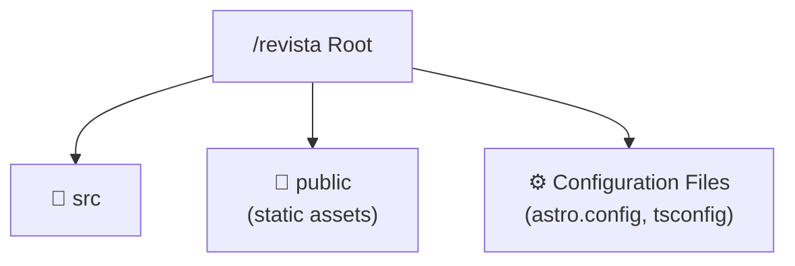
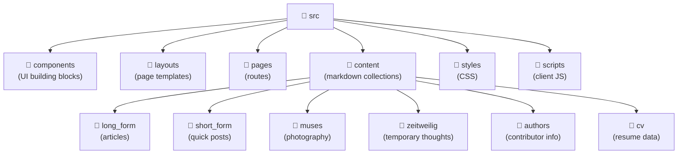
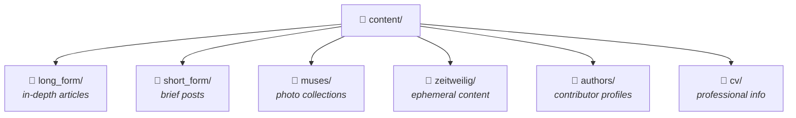
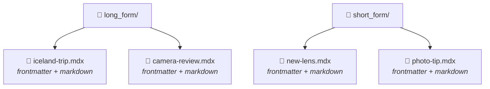
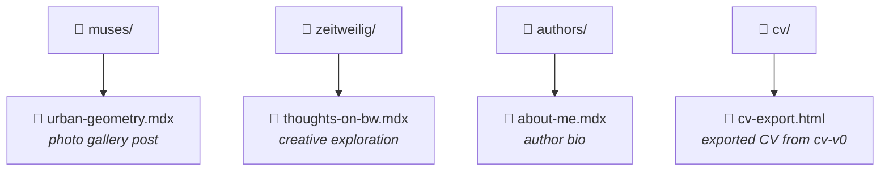
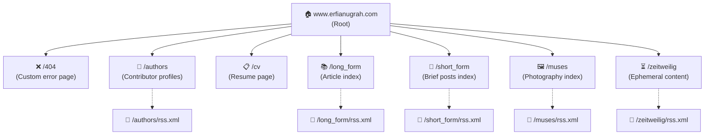
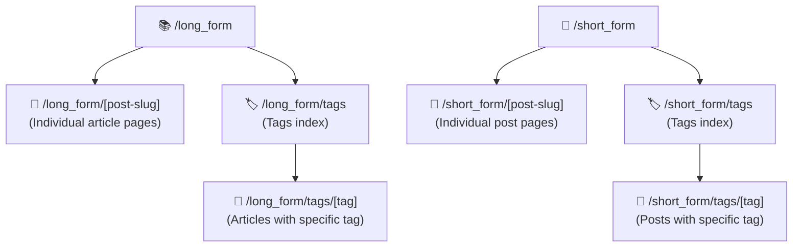
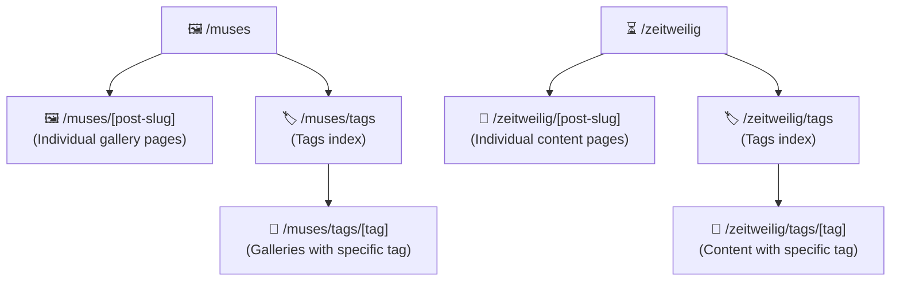

<p>
  
  
  
  
  
  
  <br/>
  
  
  
</p>

## Quick Links

- Documentation Index: `docs/README.md`

## Overview

Revista is a photography portfolio and blog built on Astro v7.2.10. I created it to showcase various photography collections and writing organized into different categories like long-form, short-form, muses, zeitweilig, and my CV. The project prioritizes speed and visual design while using Astro's content collection API to manage everything efficiently.

The project deploys to Cloudflare Workers (static assets) and as a Docker image.

## Documentation Map

- **Docs Index:** `docs/README.md`
- **Architecture:** `src/README.md`
- **Performance:** `docs/performance.md`
- **CI/CD & Deployments:** `.github/CICD.md`
- **Components:** `src/components/README.md`
- **Layouts:** `src/layouts/README.md`
- **Pages:** `src/pages/_README.md`
- **Content Collections:** `src/content/README.md`
- **Docker:** `docs/docker.md`

## Project Structure

<details>
<summary>Project Structure Diagram (click to expand)</summary>

### Top-Level Structure


```mermaid
graph TD
    A["/revista" Root] --> B["📁 src"]
    A --> C["📁 public<br>(static assets)"]
    A --> D["⚙️ Configuration Files<br>(astro.config, tsconfig)"]
```

### Source Directory Structure


```mermaid
graph TD
    B["📁 src"] --> E["📁 components<br>(UI building blocks)"]
    B --> F["📁 layouts<br>(page templates)"]
    B --> G["📁 pages<br>(routes)"]
    B --> H["📁 content<br>(markdown collections)"]
    B --> I["📁 styles<br>(CSS)"]
    B --> J["📁 scripts<br>(client JS)"]

    H --> K["📝 long_form<br>(articles)"]
    H --> L["📝 short_form<br>(quick posts)"]
    H --> M["📝 muses<br>(photography)"]
    H --> N["📝 zeitweilig<br>(temporary thoughts)"]
    H --> O["📝 authors<br>(contributor info)"]
    H --> P["📝 cv<br>(resume data)"]
```

### Component Files


```mermaid
graph TD
    E["📁 components"] --> E1["🧩 BlogPost.astro"]
    E --> E2["🧩 Footer.astro"]
    E --> E3["🧩 Header.astro"]
    E --> E4["🧩 Navigation.astro"]
    E --> E5["🧩 Homepage.astro"]
    E --> E6["🧩 Masonry.astro"]
    E --> E7["🧩 HeroImage.astro"]
    E --> E8["🧩 NextPost.astro"]
    E --> E9["🧩 ThemeToggle.astro"]

    F["📁 layouts"] --> F1["📄 BaseLayout.astro"]
    F --> F2["📄 MarkdownPostLayout.astro"]
    F --> F3["📄 AuthorLayout.astro"]
    F --> F4["📄 TagLayout.astro"]

    G["📁 pages"] --> G1["🌐 index.astro<br>(homepage)"]
    G --> G2["🌐 404.astro<br>(error page)"]
    G --> G3["🌐 cv.astro<br>(resume)"]

    I["📁 styles"] --> I1["🎨 global.css<br>(site-wide styles + Tailwind config)"]
    I --> I2["🎨 MasonryLayout.css<br>(photo grid styling)"]

    J["📁 scripts"] --> J1["⚡ theme.ts<br>(dark/light mode)"]
    J --> J2["⚡ lightbox.ts<br>(image lightbox)"]
```

</details>

### Key Directories and Files

- `src/`: Contains the main source code for the site
  - `components/`: Reusable Astro components ([Components Documentation](src/components/README.md))
    - `BlogPost.astro`: Component for rendering individual blog post previews
    - `Footer.astro`: Site-wide footer component
    - `Header.astro`: Site-wide header component
    - `Navigation.astro`: Navigation menu component
  - `layouts/`: Page layouts used across the site ([Layouts Documentation](src/layouts/README.md))
    - `BaseLayout.astro`: The main layout used by most pages
    - `MarkdownPostLayout.astro`: Layout for rendering Markdown content
  - `pages/`: Astro pages that generate routes ([Pages Documentation](src/pages/_README.md))
    - `index.astro`: The home page
    - `404.astro`: Custom 404 error page
    - `cv.astro`: CV page
  - `content/`: Markdown content for blog posts and collections ([Content Collections Documentation](src/content/README.md))
  - Architecture and implementation documentation:
    - [Technical Architecture](src/README.md): Component structure, state management, and design patterns
    - [Performance Optimization](docs/performance.md): Techniques used for site speed optimization
    - [Docker Implementation](docs/docker.md): Container configuration and deployment
    - [CI/CD Implementation](.github/CICD.md): Build and deployment automation
  - `content.config.ts`: Configuration file for content collections using Astro's glob loader pattern
  - `styles/`: CSS files for styling
    - `global.css`: Global styles and Tailwind v4 imports
    - `MasonryLayout.css`: Styles for the masonry layout used in galleries
  - `scripts/`: TypeScript files for client-side functionality
    - `theme.ts`: Shared theme preference, apply, toggle, and init helpers
    - `lightbox.ts`: Custom image lightbox with keyboard/touch navigation
    - `homePage.ts`: Homepage hero-image randomization
    - `getRandomImage.ts`: Random featured image selection for tag pages
    - `burgundy.ts`: 404 page quote rotation
    - `rss.ts`: RSS link visibility and URL management
    - `since94.ts`: Years-since-1994 counter (used in MDX)
    - `duration.ts`: Computes month counts and duration categories for timeline visualizations

    - `undici-retry.ts`: HTTP fetch retry helper for build-time requests
    - `utils.ts`: Shared `shuffle()` and `formatDate()` utilities
    - `collections.ts`: Shared `buildDetailPaths()`, `buildTagPaths()`, `generateRss()` helpers

- `public/`: Static assets like images and fonts
- Configuration files:
  - `astro.config.mjs`: Astro configuration
  - `tsconfig.json`: TypeScript configuration

## Key Features

1. **Multiple Content Collections**: The site organizes content into different types (long_form, short_form, muses, zeitweilig, authors, cv), each managed as an Astro content collection using the glob loader pattern. This gives me type-safe content management, explicit file selection, and simplified querying.

2. **Responsive Design**: The site uses Tailwind CSS for a mobile-first approach. I've customized the breakpoints to match my specific needs at 800px, 1200px, 1900px, and 2500px, which ensures the site looks good on everything from phones to ultra-wide monitors.

3. **Dark Mode**: Users can toggle between light and dark themes with the ThemeToggle component. Theme preference is stored in localStorage so it persists across visits. The dark theme uses a deep charcoal background with light text for comfortable reading at night.

4. **Dynamic Routing**: Routes are generated from the content collections themselves. Each post and tag gets its own URL automatically, making content organization much simpler.

5. **RSS Feeds**: Each content collection has its own RSS feed. I use `@astrojs/rss` to generate these dynamically, so readers can subscribe to just the content types they're interested in.

6. **SEO Optimization**: Every page includes customizable meta tags for titles, descriptions, and Open Graph data, which helps with search engine visibility and social sharing.

7. **Performance Focus**: Astro's static site generation gives the site exceptional loading times. I've also implemented lazy loading for images and prefetching for linked pages to make navigation feel instantaneous.

8. **Interactive Elements**: The site uses targeted client-side JavaScript for the mobile menu, theme toggle, and image lightbox functionality, keeping the bundle size small while adding important interactivity.

9. **Custom 404 Page**: I created a unique 404 error page featuring rotating quotes from Ron Burgundy – a little humor to lighten the mood when someone hits a missing page.

10. **CV Section**: The site includes a dedicated CV page, which shows how this platform works not just for photography and writing but also for personal branding.

## Content Management

All content lives in Markdown files located in the `src/content/` directory. Each content type has its own subdirectory.

### Content Management Tools

The project includes custom CLI tools for creating and managing content:

#### Build Commands

```bash
# Development server
bun run dev

# Standard production build
bun run build


# Preview production build
bun run preview
```

### Content Creation CLI

```bash
# Run the content creator
bun run create

# Specify content type directly
bun run create -t muses

# Preview frontmatter without creating a file (dry run)
bun run create --dry-run
# or
bun run create -d

# Show help for all options
bun run create --help

# Non-interactive mode (for scripts or automated workflows)
bun run create --non-interactive --type muses --title "Post Title" --description "Post description" --tags "tag1,tag2" --pub-date "2024-05-19T12:00:00Z" --updated-date "2024-05-20T10:00:00Z"
```

This interactive tool:

- Dynamically reads schema requirements from content.config.ts
- Provides a user-friendly interface with colored prompts
- Validates input according to schema requirements
- Generates proper filenames using date-slug.mdx pattern (uses pubDate for the filename when provided)
- Supports all content types: muses, short_form, long_form, zeitweilig, authors, cv

#### Post Update Tool

```bash
# Update an existing post's frontmatter (e.g., add/modify updated date)
bun run update-post --file muses/2025-05-19-commodification.mdx --updated-date "2025-05-20T12:00:00Z"

# Preview changes without writing to file
bun run update-post --file short_form/2025-05-19-the-essence-of-light.mdx --tags "photography,light,art,philosophy" --dry-run

# Update multiple fields at once
bun run update-post --file muses/2025-05-19-commodification.mdx \
  --title "New Title" \
  --tags "photography,art,economics,critique" \
  --updated-date "2025-05-20T08:15:00Z"
```

This tool allows you to:

- Update publication or update dates
- Change tags or categories
- Update image metadata
- Modify titles or descriptions
- Preview changes before applying them

For detailed documentation on both tools, see [scripts/README.md](scripts/README.md).

<details>
<summary>Content Management Diagram (click to expand)</summary>

### Content Directory Structure


```mermaid
graph TD
    A["📁 content/"] --> B["📁 long_form/<br><i>in-depth articles</i>"]
    A --> C["📁 short_form/<br><i>brief posts</i>"]
    A --> D["📁 muses/<br><i>photo collections</i>"]
    A --> E["📁 zeitweilig/<br><i>ephemeral content</i>"]
    A --> F["📁 authors/<br><i>contributor profiles</i>"]
    A --> G["📁 cv/<br><i>professional info</i>"]
```

### Content Files by Type


```mermaid
graph TD
    B["📁 long_form/"] --> H["📄 iceland-trip.mdx<br><i>frontmatter + markdown</i>"]
    B --> I["📄 camera-review.mdx<br><i>frontmatter + markdown</i>"]

    C["📁 short_form/"] --> J["📄 new-lens.mdx<br><i>frontmatter + markdown</i>"]
    C --> K["📄 photo-tip.mdx<br><i>frontmatter + markdown</i>"]
```

### Specialized Content Types


```mermaid
graph TD
    D["📁 muses/"] --> L["📄 urban-geometry.mdx<br><i>photo gallery post</i>"]

    E["📁 zeitweilig/"] --> M["📄 thoughts-on-bw.mdx<br><i>creative exploration</i>"]

    F["📁 authors/"] --> N["📄 about-me.mdx<br><i>author bio</i>"]

    G["📁 cv/"] --> O["📄 cv-export.html<br><i>exported CV from cv-v0</i>"]
```

</details>

Each content collection is defined with a specific schema in `content.config.ts` using Zod for validation. Here's a simplified example of the frontmatter structure:

```typescript
// content.config.ts — shared base schema eliminates duplication across collections
const baseSchema = z.object({
  title: z.string(),
  slug: z.string().optional(),
  tags: z.array(z.string()),
  author: z.string(),
  description: z.string(),
  image: z.object({
    src: z.string(),
    alt: z.string(),
    positionx: z.string().optional(),
    positiony: z.string().optional(),
  }).optional(),
  pubDate: z.coerce.date(),
  updatedDate: z.coerce.date().optional(),
});

const muses = defineCollection({
  loader: glob({ pattern: "**/[^_]*.mdx", base: "./src/content/muses" }),
  schema: baseSchema,
});

// Example frontmatter from an actual muses post:
---
title: "Stockholm: Urban Reflections"
tags: ["sweden", "architecture", "street", "reflection"]
author: "Erfi Anugrah"
description: "A winter wander through Stockholm's glass-filled business district"
image:
  src: "https://image.erfi.io/stockholm-reflections-01.jpg"
  alt: "Office building reflection with stark contrast on a winter day"
  positionx: "center"
  positiony: "50%"
pubDate: 2024-01-21
---

My weekend explorations took me to Kungsholmen, where the lowering sun
creates dramatic shadows across the sleek glass facades of Stockholm's
business district...
```

Each Markdown file includes frontmatter with metadata like title, publication date, tags, and image information. I define the content collections in `src/content.config.ts`, which specifies the schema using Zod for runtime type checking and uses Astro's glob loader pattern to identify which files belong to each collection.

## Routing

Revista uses a mix of file-based routing and dynamic route generation:

<details>
<summary>Routing Diagram (click to expand)</summary>

### Main Routes


```mermaid
graph TD
    A["🏠 www.erfianugrah.com<br>(Root)"] --> B["❌ /404<br>(Custom error page)"]
    A --> C["👤 /authors<br>(Contributor profiles)"]
    A --> D["📋 /cv<br>(Resume page)"]
    A --> E["📚 /long_form<br>(Article index)"]
    A --> F["📝 /short_form<br>(Brief posts index)"]
    A --> G["🖼️ /muses<br>(Photography index)"]
    A --> H["⏳ /zeitweilig<br>(Ephemeral content)"]

    C -.-> C0["📡 /authors/rss.xml"]
    E -.-> E0["📡 /long_form/rss.xml"]
    F -.-> F0["📡 /short_form/rss.xml"]
    G -.-> G0["📡 /muses/rss.xml"]
    H -.-> H0["📡 /zeitweilig/rss.xml"]
```

### Collection Detail Routes

All five collections (muses, short_form, long_form, zeitweilig, authors) share the same parameterised routes under `src/pages/[collection]/`:


```mermaid
graph TD
    E["📚 /long_form"] --> I["📄 /long_form/[post-slug]<br>(Individual article pages)"]
    E --> J["🏷️ /long_form/tags<br>(Tags index)"]
    J --> K["🔖 /long_form/tags/[tag]<br>(Articles with specific tag)"]

    F["📝 /short_form"] --> L["📄 /short_form/[post-slug]<br>(Individual post pages)"]
    F --> M["🏷️ /short_form/tags<br>(Tags index)"]
    M --> N["🔖 /short_form/tags/[tag]<br>(Posts with specific tag)"]
```

### Muses and Zeitweilig Routes


```mermaid
graph TD
    G["🖼️ /muses"] --> O["🖼️ /muses/[post-slug]<br>(Individual gallery pages)"]
    G --> P["🏷️ /muses/tags<br>(Tags index)"]
    P --> Q["🔖 /muses/tags/[tag]<br>(Galleries with specific tag)"]

    H["⏳ /zeitweilig"] --> R["📄 /zeitweilig/[post-slug]<br>(Individual content pages)"]
    H --> S["🏷️ /zeitweilig/tags<br>(Tags index)"]
    S --> T["🔖 /zeitweilig/tags/[tag]<br>(Content with specific tag)"]
```

</details>

The routing system combines static and parameterised dynamic routes, all driven by a single config array in `src/config/collections.ts`:

- **Static routes** like `/cv` are defined by files at `src/pages/cv.astro`
- **Parameterised collection routes** under `src/pages/[collection]/` handle all five collections via `getRouteCollection()`
- **Collection pages** use `getStaticPaths()` via shared helpers in `src/scripts/collections.ts`
- **Tag pages** are automatically generated for each tag used in the content

Each collection follows the same pattern of routes: index, individual posts, tags index, tag-specific pages, and RSS feed.

### Route Explanation:

1. **Root and Static Routes**:
   - `/`: Home page (`src/pages/index.astro`)
   - `/404`: Custom 404 error page (`src/pages/404.astro`)
   - `/cv`: CV page (`src/pages/cv.astro`)

2. **Collection Routes** (config-driven):
   For each collection defined in `src/config/collections.ts` (muses, short_form, long_form, zeitweilig, authors):
   - `/{collection}`: Index page (`src/pages/[collection]/index.astro`)
   - `/{collection}/post-id`: Individual post (`src/pages/[collection]/[...id].astro`)
   - `/{collection}/tags`: Tag index (`src/pages/[collection]/tags/index.astro`)
   - `/{collection}/tags/tag-name`: Tag-specific page (`src/pages/[collection]/tags/[tag].astro`)

3. **Dynamic Route Generation**:
   - Post pages (e.g., `/long_form/post-id`) are generated using `buildDetailPaths()` from `src/scripts/collections.ts`.
   - Tag pages (e.g., `/muses/tags/tag-name`) use `buildTagPaths()`.
   - The `[collection]` segment is resolved via `getRouteCollection()` from `src/config/collections.ts`.

4. **RSS Feeds**:
   - Each collection has an RSS feed at `/{collection}/rss.xml`, generated by `src/pages/[collection]/rss.xml.ts` via the `generateRss()` helper.

## Styling System

The site uses Tailwind CSS v4.2.2 for styling, with all configuration living in `src/styles/global.css` via `@theme` blocks, `@plugin` directives, and `@custom-variant` declarations:

### Design System Components

1. **Typography System**
   - **Custom Fonts**: The site uses two monospace fonts for a consistent technical aesthetic:
     - "Overpass Mono": A monospace font for code, technical details, and headers
     - "Inconsolata": A secondary monospace used for specific UI elements
   - These fonts were chosen for their:
     - Technical, precise aesthetic that complements photography
     - Excellent readability at different sizes
     - Wide character set support
2. **Color System**
   - **Base Light Theme**: Clean white background (#f2f2f2) with deep charcoal text (#333333)
   - **Dark Theme**: Rich dark background (#222125) with high-contrast light text (#f5f5f5)
   - **Accent Colors**: Minimal use of accent colors, focusing on photography as the visual focus
   - **Photography-Optimized**: The color scheme is designed to enhance rather than compete with images

3. **Layout System**
   - **Photography-Specific Breakpoints**: Custom breakpoints designed for optimal image viewing, defined in the `@theme` block:
     ```css
     /* src/styles/global.css @theme */
     --breakpoint-sm: 800px; /* Small devices (tablets) */
     --breakpoint-md: 1200px; /* Medium devices (laptops) */
     --breakpoint-lg: 1900px; /* Large devices (desktops) */
     --breakpoint-xl: 2500px; /* Extra large (large monitors) */
     ```
   - These breakpoints are significantly different from Tailwind defaults, prioritizing photography display over conventional web design breakpoints

4. **Component Styling**
   - **Custom Utilities**: Image focal-point overrides are applied as inline `style` attributes (e.g., `object-position: center top 33.33%`). No custom Tailwind utility extensions are needed.
   - **Typography Plugin**: The `@tailwindcss/typography` plugin provides rich styling for long-form content, loaded via `@plugin` in `global.css`.

### Styling Implementation

1. **Dark Mode Strategy**
   - **Custom Variant Implementation**: The `@custom-variant dark (&:where(.dark, .dark *))` directive drives Tailwind's dark variant. Theme state is managed by `src/scripts/theme.ts` and toggled via the `ThemeToggle.astro` vanilla component.

2. **CSS Organization**
   - **Global Styles**: `src/styles/global.css` contains:

     ```css
     /* Tailwind v4 single import */
     @import "tailwindcss";
     @plugin "@tailwindcss/typography";
     @custom-variant dark (&:where(.dark, .dark *));

     @theme {
       --breakpoint-sm: 800px;
       --breakpoint-md: 1200px;
       --breakpoint-lg: 1900px;
       --breakpoint-xl: 2500px;
       --font-overpass-mono:
         var(--font-overpass-mono), "Overpass Mono", monospace;
       --font-inconsolata: var(--font-inconsolata), "Inconsolata", monospace;
     }
     ```

   - **Component-specific CSS**:
     - `MasonryLayout.css`: Custom grid-based implementation
     - `lightbox.css`: Custom lightbox styling (fade transitions, overlay, controls)

3. **Inline Styles**
   - The project uses inline `style` attributes for dynamic positioning (image focal points, parallax offsets). No CSS-in-JS -- all styles are either Tailwind utilities or plain CSS.

### Style Architecture Principles

1. **Component-First Approach**: Styles are primarily applied using Tailwind utility classes in components
2. **Minimal Custom CSS**: Custom CSS is only used for complex layouts that Tailwind can't easily handle
3. **Consistent Color Variables**: Color references use CSS variables for theme consistency
4. **Media Query Standardization**: All responsive designs use the custom breakpoint system
5. **Print Considerations**: Special styling for PDF/print versions of content (especially CV)

## Scripts and Utilities

Client-side JavaScript lives in the `src/scripts/` directory, providing essential interactivity while maintaining a focus on performance:

### Core UI Scripts

- **`theme.ts`**: Shared theme management module with the following features:
  - `getThemePreference()`: reads from localStorage, falls back to `prefers-color-scheme`
  - `applyTheme()`: adds/removes the `dark` class on the document root
  - `toggleTheme()`: cycles the theme and persists to localStorage
  - `initTheme()`: inline-safe initialiser used by ThemeToggle.astro to prevent FOUC

### Media Management

- **`lightbox.ts`**: Custom image lightbox (replaced GLightbox - 73 KB -> ~2.4 KB gzipped):
  - Multi-level zoom: click cycles 2x -> 3.5x -> reset; scroll wheel for cursor-anchored incremental zoom (up to 5x); continuous pinch zoom on touch
  - Zoom uses `scale() + translate3d()` - a single CSS transform, pure compositor operation, no layout recalculation on any frame
  - Keyboard navigation (arrow keys, Escape zooms out first then closes)
  - Touch swipe navigation at 1x, drag/pan when zoomed
  - Fade transitions, prev/next/close/zoom controls, image counter
  - Adjacent image preloading, body scroll lock
  - Full View Transitions lifecycle support (destroy/reinit on `astro:page-load`)

- **`getRandomImage.ts`**: Entry point for tag-page random images -- wires the `.randomimage` selector via `initRandomImages()` from `randomImage.ts` on `astro:page-load`
  - Handles empty image arrays gracefully

### Content Enhancement

- **`burgundy.ts`**: Creates the dynamic quote system for the 404 page:
  - Stores a collection of Ron Burgundy quotes
  - Randomly selects and displays a different quote on each page load
  - Sets up a rotating quote system with fade transitions

- **`rss.ts`**: Manages RSS subscription features:
  - Conditionally shows/hides RSS links based on the current page
  - Updates RSS link URLs dynamically
  - Provides visual feedback when subscription options are available

- **`homePage.ts`**: Entry point for homepage hero-image randomization -- wires the `#homepage` selector via `initRandomImages()` from `randomImage.ts` (with `updateAnchor: true`) on `astro:page-load`

### Shared Utilities

- **`utils.ts`**: Common helpers shared across scripts:
  - `shuffle()`: Fisher-Yates array shuffle
  - `formatDate()`: formats a Date to `"Mon DD, YYYY HH:MM:SS.mmm"` using `toLocaleDateString("en-US", ...)` plus manual time sub-fields

- **`collections.ts`**: Shared content collection helpers:
  - `CollectionName` type: union of all content collection keys (`"muses" | "short_form" | …`), used across layouts and pages for type-safe `getCollection()` calls
  - `buildDetailPaths()`: generates `getStaticPaths` for `[...id].astro` pages
  - `buildTagPaths()`: generates `getStaticPaths` for `tags/[tag].astro` pages
  - `generateRss()`: generates RSS feed XML for any collection

### Build Utilities

- **`remark-reading-time.mjs`**: MDX plugin that calculates and adds reading time estimates to posts

All scripts are TypeScript (except the remark plugin which remains `.mjs`), minimal, focused, and non-blocking to maintain the site's performance profile.

### Build Pipeline

- **`prebuild`** (automatic): Runs `scripts/sync-readme-versions.js` to keep version badges in docs in sync with `package.json`.
- **`postbuild`** (automatic): Runs Pagefind indexing over the `dist/` output.

## Astro Configuration Highlights

The `astro.config.mjs` includes several features worth noting:

1. **Math Rendering**: `remark-math` + `rehype-katex` for LaTeX-style equations in MDX content
2. **MDX remarkPlugins**: The `mdx()` integration inherits `remarkPlugins` and `rehypePlugins` from the base `markdown` config, so plugins only need to be listed once.
3. **Dual Shiki Themes**: Syntax highlighting uses `rose-pine-dawn` (light) and `tokyo-night` (dark) with `defaultColor: false` so both themes are emitted and CSS controls which one is visible
4. **Sitemap Generation**: `@astrojs/sitemap` automatically generates `sitemap-index.xml` during build
5. **Experimental Client Prerendering**: `clientPrerender: true` enables speculative prerendering of linked pages for near-instant navigation
6. **Experimental Fonts API**: Fonts (Inconsolata, Overpass Mono) are loaded via Astro's font provider system with `optimizedFallbacks: true` for reduced CLS
7. **undici-retry**: Custom Astro integration (`src/scripts/undici-retry.ts`) that patches the global fetch with retry logic for build-time HTTP requests

## Performance Optimization

I've optimized the site in several ways:

1. **Image Processing**: Using Astro's `getImage` function to convert images to efficient formats and appropriate dimensions.

2. **Lazy Loading**: Images load on demand using the `loading="lazy"` attribute, which prevents initial page load delays.

3. **Preloading and Prefetching**: Astro's `prefetch` feature loads linked pages before the user clicks, making navigation feel instant.

4. **Efficient Bundling**: Astro v7.2.10 includes improved bundling and tree-shaking to minimize client-side code, with enhanced hydration strategies and faster component rendering.

5. **Cloudflare CDN**: The site uses Cloudflare's CDN with custom cache headers to serve content from edge locations worldwide.

6. **Tailwind Optimizations**: Tailwind CSS v4.2.2's improved performance and lighter bundle size help pages load quickly.

## Search Functionality

The site includes search powered by [Pagefind](https://pagefind.app/) using the raw JS API (`/pagefind/pagefind.js`) with a custom search modal. The search trigger is an SVG icon button in `Header.astro` alongside the theme toggle and hamburger. The modal dialog markup lives in `Pagefind.astro` (rendered via `Navigation.astro`) and the search logic in `src/scripts/pagefind.ts`, referenced via `<script src>` so it ships as a build-emitted chunk.

1. **Comprehensive Content Indexing**: Automatically indexes all site content during the build process (via a postbuild script defined in package.json). Content pages use `data-pagefind-body` to mark indexable regions, `data-pagefind-filter` for collection-based filtering, and `data-pagefind-sort`/`data-pagefind-meta` for date sorting and metadata.

2. **Custom Modal Search**: A native `<dialog>` element with debounced search input, result cards with thumbnail images, excerpt highlighting, and a summary count. The Pagefind JS API is lazy-loaded on first search and cached.

3. **Dark Mode Support**: Uses the site's `.dark` class directly in CSS selectors — no attribute syncing needed.

4. **Keyboard Shortcut**: `Ctrl+K` / `Cmd+K` opens the search modal from anywhere on the page.

5. **ClientRouter Compatible**: The `setup()` function runs on every `astro:page-load` event, ensuring fresh DOM queries and event listeners after each client-side navigation.

6. **Collection Filtering**: Search results can be filtered by content collection (muses, short_form, long_form, zeitweilig, authors) via `data-pagefind-filter` attributes on the content layouts.

```html
<!-- Header.astro: search icon button -->
<button id="searchTrigger" aria-label="Search" aria-haspopup="dialog">
  <svg>...</svg>
</button>

<!-- Pagefind.astro: custom modal; logic in src/scripts/pagefind.ts -->
<dialog id="searchDialog">
  <input id="searchInput" type="search" placeholder="Search..." />
  <div id="searchResults"></div>
</dialog>
<script src="../scripts/pagefind.ts"></script>

<script>
  // src/scripts/pagefind.ts: lazy-load Pagefind JS API on first search
  const pagefind = await import("/pagefind/pagefind.js");
  const search = await pagefind.search(query);
  // Render results manually...
</script>
```

## Internationalization

While the site is currently in English, I've structured it with future translation in mind:

1. The RSS feeds include language tags (`<language>en-us</language>`)
2. The content structure would easily support localized content in additional languages

## External Integrations

1. **Cloudflare**:
   - Handles hosting and CDN services

   - Maintains compatibility with other deployment targets through environment-specific builds

## Development Tools

1. **Bun**:
   - Works as both the JavaScript runtime and package manager
   - Significantly faster than Node.js and npm, especially on M-series Macs
   - All scripts in `package.json` run through Bun

2. **TypeScript**:
   - The project uses TypeScript v5.9.3 throughout
   - Astro's built-in TypeScript support with `@astrojs/check` v0.9.10 catches type errors during build

3. **Prettier**:
   - Code formatting with Prettier v3.8.1 ensures consistent style
   - The Astro Prettier plugin (prettier-plugin-astro v0.14.1) properly formats .astro files

4. **Tailwind CSS v4**:
   - The latest Tailwind CSS v4.2.2 with better performance and smaller bundles
   - Configured with the typography plugin for long-form content

5. **Playwright**:
   - End-to-end test suite with 88 tests across 15 spec files
   - Run with `bunx playwright test` or target a single file with `bunx playwright test tests/spec-name.spec.ts`

## CI/CD Workflow

The GitHub Actions workflow in `.github/workflows/deploy.yml` handles deployment:

1. **Build Process**:
   - Uses Bun for faster dependency installation and builds
   - Implements dependency caching to speed up subsequent builds
   - Includes retry logic in case of transient errors

2. **Cloudflare Deployment**:
   - Deploys to Cloudflare Workers (with static assets) via Wrangler

3. **Docker Handling**:
   - Builds a multi-architecture Docker image for broader compatibility
   - Pushes to Docker Hub for container-based deployments
   - Signs the image with Cosign for security verification

4. **Cache Management**:
   - Purges Cloudflare's edge cache after each deployment

## Docker Setup

The project includes Docker support for containerized deployment using BusyBox httpd as the web server.

### Quick Start

```bash
# Build the container (requires a pre-built dist/)
bun run build
docker build -t revista:latest .

# Run the container
docker run -p 8080:80 revista:latest

# Or use docker compose
docker compose up -d
```

### Dockerfile

```dockerfile
FROM busybox:1.37
COPY dist /var/www
CMD ["httpd", "-f", "-p", "80", "-h", "/var/www"]
EXPOSE 80
```

A single-stage build: the `dist/` directory is pre-built with `bun run build` and copied into the image. BusyBox httpd serves static files with no runtime dependencies, no config files, and no scripting -- Cloudflare handles compression, cache headers, and HTTPS at the edge. See [docs/docker.md](docs/docker.md) for the full configuration.

### Multi-Architecture Support

The CI/CD pipeline builds for `linux/amd64`, `linux/arm64`, `linux/arm/v6`, and `linux/arm/v7`. For manual multi-platform builds:

```bash
docker buildx create --name mybuilder --use --driver docker-container
docker buildx build \
  --platform linux/arm64,linux/amd64,linux/arm/v6,linux/arm/v7 \
  -t [repo]/[image-name]:[tag] . \
  --push
```

### Key Details

1. Uses BusyBox 1.37 for a minimal footprint (~2.5 MB image)
2. Single static binary, single process -- minimal attack surface
3. Resource limits: 1 CPU and 64 MB RAM (configured in compose.yaml)
4. Exposes port 80 (Cloudflare handles HTTPS in production)
5. Image signed with Cosign in CI for supply chain security

## Security Measures

1. **Docker Image Signing**: The CI/CD pipeline signs Docker images with Cosign to prevent tampering.

2. **Content Security**: The RSS feed generation uses `sanitize-html` to prevent XSS vulnerabilities.

3. **Secure Hosting**: Cloudflare provides DDoS protection, SSL, and other security features.

## Environment Setup

For local development, you'll need:

1. Bun 1.2.21 (lockfile and scripts are generated with this version)
2. Node.js 20+ (only needed if you prefer npm/yarn tooling; builds run with Bun)
3. Git
4. VS Code with the Astro extension is recommended

## Getting Started

To start working with this project:

1. Clone the repository:

   ```
   git clone https://github.com/your-username/revista.git
   cd revista
   ```

1. Install dependencies:

   ```
   bun install
   ```

   This installs:
   - Astro v7.2.10
   - Tailwind CSS v4.2.2
   - @astrojs/mdx v8.0.0 and other dependencies

1. Run the development server:

   ```
   bun run dev
   ```

1. Build for production:

   ```bash
   # Standard build (for Cloudflare Workers and the Docker image)
   bun run build
   ```

   Both commands include Pagefind indexing for search functionality.

1. (Optional) Run local quality checks before committing:

   ```bash
   bun run lint:site   # build, HTML validate, and internal link check
   ```

1. Content workflows: the CLI helpers for creating/editing posts are documented in `scripts/README.md`.

1. Preview the production build:
   ```
   bun run preview
   ```

## Deployment Options

The project supports several deployment methods:

1. Cloudflare Workers (primary)
2. Docker container (deployable to any container platform)

### Deployment Secrets & Tokens

| Target             | Required secrets (GitHub Actions)                    | Notes                                                                                                                 |
| ------------------ | ---------------------------------------------------- | --------------------------------------------------------------------------------------------------------------------- |
| Cloudflare Workers | `CLOUDFLARE_WRANGLER_TOKEN`, `CLOUDFLARE_ACCOUNT_ID` | Wrangler deploy only - static-asset deploys are atomic and asset URLs are content-hashed, so no cache purge is needed |
| Docker Hub         | `DOCKER_USERNAME`, `DOCKER_REGISTRY_TOKEN`           | Used for pushing versioned images                                                                                     |

## Contributing

When contributing:

1. Get familiar with Astro's content collections and routing
2. Follow the existing code style and use Tailwind for styling
3. Test your changes on various screen sizes
4. Update or add tests for new features
5. Update documentation when necessary
6. Use Bun for running scripts and managing dependencies

## Troubleshooting

If you run into problems:

1. Make sure all dependencies are installed (`bun install`)
2. Try clearing the Astro cache (`.astro` directory) for build errors
3. Check the Astro Discord for help with common issues
4. Verify that Bun is up to date

## License

This project is licensed under the MIT License - see the [LICENSE](LICENSE) file for details.

**Note:** The blog content (posts, articles, images, etc.) is not covered by the MIT License. All rights to the content are reserved by the respective authors unless otherwise specified.

## Acknowledgments

- The Astro community for building such a great static site generator
- Tailwind CSS for their utility-first approach
- Cloudflare for reliable hosting and CDN services
- All contributors who have helped improve this project

## Contact

For questions about this project, please open an issue on the GitHub repository.

## Future Roadmap

Some ideas I'm considering for future updates:

1. Full multilingual support
2. Enhanced search with additional filtering and sorting options
3. Integration with a headless CMS
4. Automated image optimization workflow
5. More interactive gallery views

## Component Highlights

### CV Page

The CV page (`src/pages/cv.astro`) imports a pre-rendered HTML export from my separate [cv-v0](https://github.com/erfianugrah/cv-v0) Next.js app rather than building the CV from Astro components:

1. **HTML Import Pipeline**: At build time, `cv.astro` reads `src/content/cv/cv-export.html` (a Puppeteer DOM capture from cv-v0), extracts `<style>` blocks and `<body>` content, strips conflicting `html`/`body` rules, and rescopes `body > div` selectors to `.cv-imported`.

2. **Dark Mode Overrides**: The cv-v0 export uses Tailwind utility classes (`.text-gray-900`, `.text-gray-700`, etc.) as real class tokens, so dark mode is handled by targeting those classes directly under `.dark .cv-imported` with appropriate slate-palette colors.

3. **Minimal Shell**: The page uses `BaseLayout` with `hideHeaderFooter` and just renders a theme toggle above the imported CV content. No nav, no print button, no section scroll-spy.

4. **Updating**: To update the CV, re-export from cv-v0 and replace `src/content/cv/cv-export.html`.

### Masonry Layout System

The photo gallery displays use a CSS Grid masonry layout with focal-point-aware cropping:

1. **CSS Grid with Dense Packing**: Editorial-style grid with `nth-child` span rules for visual rhythm:

   ```css
   .masonry {
     display: grid;
     grid-template-columns: repeat(auto-fill, minmax(200px, 1fr));
     gap: 12px;
     grid-auto-flow: dense;
   }

   .image-container:nth-child(3n) {
     grid-row: span 2;
   }
   .image-container:nth-child(4n) {
     grid-column: span 2;
   }
   ```

2. **Smart Crop Positioning**: Images default to `object-position: center 25%` so subjects (faces, upper-third content) stay visible when cropped by the grid. Per-image overrides via `positionx`/`positiony` props:

   ```jsx
   // Default smart crop — no override needed for most photos
   { src: "https://image.erfi.io/photo.jpg", alt: "Photo" }

   // Fine-tune a specific image's crop anchor
   { src: "https://image.erfi.io/photo.jpg", alt: "Photo", positionx: "30%", positiony: "10%" }
   ```

3. **Native CSS Masonry (Progressive Enhancement)**: `@supports (grid-template-rows: masonry)` automatically upgrades to true masonry layout when browsers ship CSS Grid Level 3, with no cropping needed.

4. **Custom Lightbox Integration**: Gallery images open in a purpose-built lightbox (~2.4 KB gzipped) with multi-level zoom, cursor-anchored scroll zoom, drag/pan, pinch zoom, keyboard and touch navigation — replacing the 73 KB GLightbox dependency.

5. **Image Optimization**: All thumbnails are processed through Astro's `getImage()` to AVIF format, while lightbox `href` links point to original CDN images for full-resolution viewing.

## Code of Conduct

While not explicitly documented, I expect all contributors to be respectful and inclusive in all interactions.

---

This README will continue to evolve as the project does. Feel free to suggest improvements!
