<p>
  
  
  
  
  
  
  
  <br/>
  
  
  
  
  
</p>

## Quick Links
- Documentation Index: `docs/README.md`

## Overview

Revista is a photography portfolio and blog built on Astro v5.16.4. I created it to showcase various photography collections and writing organized into different categories like long-form, short-form, muses, zeitweilig, and my CV. The project prioritizes speed and visual design while using Astro's content collection API to manage everything efficiently.

The project supports multiple deployment targets with optimized builds for each platform, including GitHub Pages with proper base path configuration.

## Documentation Map
- **Docs Index:** `docs/README.md`
- **Architecture:** `src/Architecture-README.md`
- **Performance:** `src/Performance-README.md`
- **CI/CD & Deployments:** `src/CI-CD-README.md`
- **Components/Layout/Pages:** `src/Components-README.md`, `src/Layouts-README.md`, `src/Pages-README.md`
- **Content Collections:** `src/Content-README.md`

## Project Structure

<details>
<summary>Project Structure Diagram (click to expand)</summary>

### Top-Level Structure

```mermaid
graph TD
    classDef root fill:#f9f7f3,stroke:#333,stroke-width:2px
    classDef mainDir fill:#f2e9de,stroke:#333,stroke-width:1px

    A["/revista" Root] --> B["📁 src"]
    A --> C["📁 public<br>(static assets)"]
    A --> D["⚙️ Configuration Files<br>(astro.config, tailwind.config)"]

    class A root
    class B,C,D mainDir
```



### Source Directory Structure

```mermaid
graph TD
    classDef mainDir fill:#f2e9de,stroke:#333,stroke-width:1px
    classDef contentDir fill:#e9d8c4,stroke:#333,stroke-width:1px

    B["📁 src"] --> E["📁 components<br>(UI building blocks)"]
    B --> F["📁 layouts<br>(page templates)"]
    B --> G["📁 pages<br>(routes)"]
    B --> H["📁 content<br>(markdown collections)"]
    B --> I["📁 styles<br>(CSS)"]
    B --> J["📁 scripts<br>(client JS)"]

    H --> K["📝 long_form<br>(articles)"]
    H --> L["📝 short_form<br>(quick posts)"]
    H --> M["📝 muses<br>(photography)"]
    H --> N["📝 zeitweilig<br>(temporary thoughts)"]
    H --> O["📝 authors<br>(contributor info)"]
    H --> P["📝 cv<br>(resume data)"]

    class B,E,F,G,H,I,J mainDir
    class K,L,M,N,O,P contentDir
```



### Component Files

```mermaid
graph TD
    classDef compFile fill:#e0f0e3,stroke:#333,stroke-width:1px
    classDef layoutFile fill:#e3e0f0,stroke:#333,stroke-width:1px
    classDef pageFile fill:#f0e0e3,stroke:#333,stroke-width:1px
    classDef styleFile fill:#f0e3e0,stroke:#333,stroke-width:1px
    classDef scriptFile fill:#e0e3f0,stroke:#333,stroke-width:1px

    E["📁 components"] --> E1["🧩 BlogPost.astro"]
    E --> E2["🧩 Footer.astro"]
    E --> E3["🧩 Header.astro"]
    E --> E4["🧩 Navigation.astro"]

    F["📁 layouts"] --> F1["📄 BaseLayout.astro"]
    F --> F2["📄 MarkdownPostLayout.astro"]

    G["📁 pages"] --> G1["🌐 index.astro<br>(homepage)"]
    G --> G2["🌐 404.astro<br>(error page)"]
    G --> G3["🌐 cv.astro<br>(resume)"]

    I["📁 styles"] --> I1["🎨 global.css<br>(site-wide styles)"]
    I --> I2["🎨 MasonryLayout.css<br>(photo grid styling)"]

    J["📁 scripts"] --> J1["⚡ menu.js<br>(mobile navigation)"]
    J --> J2["⚡ themetoggle.js<br>(dark/light mode)"]

    class E1,E2,E3,E4 compFile
    class F1,F2 layoutFile
    class G1,G2,G3 pageFile
    class I1,I2 styleFile
    class J1,J2 scriptFile
```



</details>

### Key Directories and Files

- `src/`: Contains the main source code for the site
  - `components/`: Reusable Astro components ([Components Documentation](src/Components-README.md))
    - `BlogPost.astro`: Component for rendering individual blog post previews
    - `Footer.astro`: Site-wide footer component
    - `Header.astro`: Site-wide header component
    - `Navigation.astro`: Navigation menu component
  - `layouts/`: Page layouts used across the site ([Layouts Documentation](src/Layouts-README.md))
    - `BaseLayout.astro`: The main layout used by most pages
    - `MarkdownPostLayout.astro`: Layout for rendering Markdown content
  - `pages/`: Astro pages that generate routes ([Pages Documentation](src/Pages-README.md))
    - `index.astro`: The home page
    - `404.astro`: Custom 404 error page
    - `cv.astro`: CV page
  - `content/`: Markdown content for blog posts and collections ([Content Collections Documentation](src/Content-README.md))
  - Architecture and implementation documentation:
    - [Technical Architecture](src/Architecture-README.md): Component structure, state management, and design patterns
    - [Performance Optimization](src/Performance-README.md): Techniques used for site speed optimization
    - [Docker Implementation](src/Docker-README.md): Container configuration and deployment
    - [CI/CD Implementation](src/CI-CD-README.md): Build and deployment automation
  - `content.config.ts`: Configuration file for content collections using Astro's glob loader pattern
  - `styles/`: CSS files for styling
    - `global.css`: Global styles and Tailwind v4 imports
    - `MasonryLayout.css`: Styles for the masonry layout used in galleries
  - `scripts/`: JavaScript files for client-side functionality
    - `menu.js`: Handles mobile menu functionality
    - `themetoggle.js`: Manages dark/light theme toggling
- `public/`: Static assets like images and fonts
- Configuration files:
  - `astro.config.mjs`: Astro configuration
  - `tailwind.config.mjs`: Tailwind CSS configuration
  - `tsconfig.json`: TypeScript configuration

## Key Features

1. **Multiple Content Collections**: The site organizes content into different types (long_form, short_form, muses, zeitweilig, authors, cv), each managed as an Astro content collection using the glob loader pattern. This gives me type-safe content management, explicit file selection, and simplified querying.

2. **Responsive Design**: The site uses Tailwind CSS for a mobile-first approach. I've customized the breakpoints to match my specific needs at 800px, 1200px, 1900px, 2500px, and 3800px, which ensures the site looks good on everything from phones to ultra-wide monitors.

3. **Dark Mode**: Users can toggle between light and dark themes with the ThemeToggle component. Theme preference is stored in localStorage so it persists across visits. The dark theme uses a deep charcoal background with light text for comfortable reading at night.

4. **Dynamic Routing**: Routes are generated from the content collections themselves. Each post and tag gets its own URL automatically, making content organization much simpler.

5. **RSS Feeds**: Each content collection has its own RSS feed. I use `@astrojs/rss` to generate these dynamically, so readers can subscribe to just the content types they're interested in.

6. **SEO Optimization**: Every page includes customizable meta tags for titles, descriptions, and Open Graph data, which helps with search engine visibility and social sharing.

7. **Performance Focus**: Astro's static site generation gives the site exceptional loading times. I've also implemented lazy loading for images and prefetching for linked pages to make navigation feel instantaneous.

8. **Interactive Elements**: The site uses targeted client-side JavaScript for the mobile menu, theme toggle, and image lightbox functionality, keeping the bundle size small while adding important interactivity.

9. **Custom 404 Page**: I created a unique 404 error page featuring rotating quotes from Ron Burgundy – a little humor to lighten the mood when someone hits a missing page.

10. **CV Section**: The site includes a dedicated CV page, which shows how this platform works not just for photography and writing but also for personal branding.

## Content Management

All content lives in Markdown files located in the `src/content/` directory. Each content type has its own subdirectory.

### Content Management Tools

The project includes custom CLI tools for creating and managing content:

#### Build Commands

```bash
# Development server
bun run dev

# Standard production build
bun run build

# GitHub Pages specific build (includes base path configuration)
bun run build:github-pages

# Preview production build
bun run preview
```

### Content Creation CLI

```bash
# Run the content creator
bun run create

# Specify content type directly
bun run create -t muses

# Preview frontmatter without creating a file (dry run)
bun run create --dry-run
# or
bun run create -d

# Show help for all options
bun run create --help

# Non-interactive mode (for scripts or automated workflows)
bun run create --non-interactive --type muses --title "Post Title" --description "Post description" --tags "tag1,tag2" --pub-date "2024-05-19T12:00:00Z" --updated-date "2024-05-20T10:00:00Z"
```

This interactive tool:

- Dynamically reads schema requirements from content.config.ts
- Provides a user-friendly interface with colored prompts
- Validates input according to schema requirements
- Generates proper filenames using date-slug.mdx pattern (uses pubDate for the filename when provided)
- Supports all content types: muses, short_form, long_form, zeitweilig, authors, cv

#### Post Update Tool

```bash
# Update an existing post's frontmatter (e.g., add/modify updated date)
bun run update-post --file muses/2025-05-19-commodification.mdx --updated-date "2025-05-20T12:00:00Z"

# Preview changes without writing to file
bun run update-post --file short_form/2025-05-19-the-essence-of-light.mdx --tags "photography,light,art,philosophy" --dry-run

# Update multiple fields at once
bun run update-post --file muses/2025-05-19-commodification.mdx \
  --title "New Title" \
  --tags "photography,art,economics,critique" \
  --updated-date "2025-05-20T08:15:00Z"
```

This tool allows you to:

- Update publication or update dates
- Change tags or categories
- Update image metadata
- Modify titles or descriptions
- Preview changes before applying them

For detailed documentation on both tools, see [scripts/README.md](scripts/README.md).

<details>
<summary>Content Management Diagram (click to expand)</summary>

### Content Directory Structure

```mermaid
graph TD
    classDef rootDir fill:#f5f5f5,stroke:#333,stroke-width:2px
    classDef contentType fill:#e8f4f8,stroke:#333,stroke-width:1px

    A["📁 content/"] --> B["📁 long_form/<br><i>in-depth articles</i>"]
    A --> C["📁 short_form/<br><i>brief posts</i>"]
    A --> D["📁 muses/<br><i>photo collections</i>"]
    A --> E["📁 zeitweilig/<br><i>ephemeral content</i>"]
    A --> F["📁 authors/<br><i>contributor profiles</i>"]
    A --> G["📁 cv/<br><i>professional info</i>"]

    class A rootDir
    class B,C,D,E,F,G contentType
```



### Content Files by Type

```mermaid
graph TD
    classDef contentType fill:#e8f4f8,stroke:#333,stroke-width:1px
    classDef mdFile fill:#f8f4e8,stroke:#333,stroke-width:1px

    B["📁 long_form/"] --> H["📄 iceland-trip.mdx<br><i>frontmatter + markdown</i>"]
    B --> I["📄 camera-review.mdx<br><i>frontmatter + markdown</i>"]

    C["📁 short_form/"] --> J["📄 new-lens.mdx<br><i>frontmatter + markdown</i>"]
    C --> K["📄 photo-tip.mdx<br><i>frontmatter + markdown</i>"]

    class B,C contentType
    class H,I,J,K mdFile
```



### Specialized Content Types

```mermaid
graph TD
    classDef contentType fill:#e8f4f8,stroke:#333,stroke-width:1px
    classDef mdFile fill:#f8f4e8,stroke:#333,stroke-width:1px

    D["📁 muses/"] --> L["📄 urban-geometry.mdx<br><i>photo gallery post</i>"]

    E["📁 zeitweilig/"] --> M["📄 thoughts-on-bw.mdx<br><i>creative exploration</i>"]

    F["📁 authors/"] --> N["📄 about-me.mdx<br><i>author bio</i>"]

    G["📁 cv/"] --> O["📄 resume.mdx<br><i>professional experience</i>"]

    class D,E,F,G contentType
    class L,M,N,O mdFile
```



</details>

Each content collection is defined with a specific schema in `content.config.ts` using Zod for validation. Here's a simplified example of the frontmatter structure:

```typescript
// Example collection schema in content.config.ts
const muses = defineCollection({
  loader: glob({ pattern: "**\/[^_]*.mdx", base: "./src/content/muses" }),
  schema: z.object({
    title: z.string(),
    tags: z.array(z.string()),
    author: z.string(),
    description: z.string(),
    image: z.object({
      src: z.string(),
      alt: z.string(),
      positionx: z.string().optional(),
      positiony: z.string().optional(),
    }).optional(),
    pubDate: z.coerce.date(),
    updatedDate: z.coerce.date().optional(),
  }),
});

// Example frontmatter from an actual muses post:
---
title: "Stockholm: Urban Reflections"
tags: ["sweden", "architecture", "street", "reflection"]
author: "Erfi Anugrah"
description: "A winter wander through Stockholm's glass-filled business district"
image:
  src: "https://cdn.erfianugrah.com/stockholm-reflections-01.jpg"
  alt: "Office building reflection with stark contrast on a winter day"
  positionx: "center"
  positiony: "top-33"
pubDate: 2024-01-21
---

My weekend explorations took me to Kungsholmen, where the lowering sun
creates dramatic shadows across the sleek glass facades of Stockholm's
business district...
```

Each Markdown file includes frontmatter with metadata like title, publication date, tags, and image information. I define the content collections in `src/content.config.ts`, which specifies the schema using Zod for runtime type checking and uses Astro's glob loader pattern to identify which files belong to each collection.

## Routing

Revista uses a mix of file-based routing and dynamic route generation:

<details>
<summary>Routing Diagram (click to expand)</summary>

### Main Routes

```mermaid
graph TD
    classDef rootRoute fill:#f8f8f8,stroke:#333,stroke-width:2px
    classDef staticRoute fill:#f0f8ff,stroke:#333,stroke-width:1px

    A["🏠 www.erfianugrah.com<br>(Root)"] --> B["❌ /404<br>(Custom error page)"]
    A --> C["👤 /authors<br>(Contributor profiles)"]
    A --> D["📋 /cv<br>(Resume page)"]
    A --> E["📚 /long_form<br>(Article index)"]
    A --> F["📝 /short_form<br>(Brief posts index)"]
    A --> G["🖼️ /muses<br>(Photography index)"]
    A --> H["⏳ /zeitweilig<br>(Ephemeral content)"]

    %% RSS feeds
    E -.-> E0["📡 /long_form/rss.xml"]
    F -.-> F0["📡 /short_form/rss.xml"]
    G -.-> G0["📡 /muses/rss.xml"]
    H -.-> H0["📡 /zeitweilig/rss.xml"]

    class A rootRoute
    class B,C,D,E,F,G,H staticRoute
    class E0,F0,G0,H0 staticRoute
```



### Long-form and Short-form Routes

```mermaid
graph TD
    classDef staticRoute fill:#f0f8ff,stroke:#333,stroke-width:1px
    classDef dynamicRoute fill:#fff0f5,stroke:#333,stroke-width:1px
    classDef tagRoute fill:#f5fff0,stroke:#333,stroke-width:1px

    %% Long-form routes
    E["📚 /long_form"] --> I["📄 /long_form/[post-slug]<br>(Individual article pages)"]
    E --> J["🏷️ /long_form/tags<br>(Tags index)"]
    J --> K["🔖 /long_form/tags/[tag]<br>(Articles with specific tag)"]

    %% Short-form routes
    F["📝 /short_form"] --> L["📄 /short_form/[post-slug]<br>(Individual post pages)"]
    F --> M["🏷️ /short_form/tags<br>(Tags index)"]
    M --> N["🔖 /short_form/tags/[tag]<br>(Posts with specific tag)"]

    class E,F staticRoute
    class I,L dynamicRoute
    class J,K,M,N tagRoute
```



### Muses and Zeitweilig Routes

```mermaid
graph TD
    classDef staticRoute fill:#f0f8ff,stroke:#333,stroke-width:1px
    classDef dynamicRoute fill:#fff0f5,stroke:#333,stroke-width:1px
    classDef tagRoute fill:#f5fff0,stroke:#333,stroke-width:1px

    %% Muses routes
    G["🖼️ /muses"] --> O["🖼️ /muses/[post-slug]<br>(Individual gallery pages)"]
    G --> P["🏷️ /muses/tags<br>(Tags index)"]
    P --> Q["🔖 /muses/tags/[tag]<br>(Galleries with specific tag)"]

    %% Zeitweilig routes
    H["⏳ /zeitweilig"] --> R["📄 /zeitweilig/[post-slug]<br>(Individual content pages)"]
    H --> S["🏷️ /zeitweilig/tags<br>(Tags index)"]
    S --> T["🔖 /zeitweilig/tags/[tag]<br>(Content with specific tag)"]

    class G,H staticRoute
    class O,R dynamicRoute
    class P,Q,S,T tagRoute
```



</details>

The routing system combines static and dynamic routes:

- **Static routes** like `/muses` are defined by files at `src/pages/muses.astro`
- **Dynamic routes** like `/long_form/camera-review` are handled by `src/pages/long_form/[...id].astro`
- **Collection pages** use `getStaticPaths()` to generate routes from content collections
- **Tag pages** are automatically generated for each tag used in the content

Each collection follows the same pattern of routes: index, individual posts, tags index, and tag-specific pages.

### Route Explanation:

1. **Root and Static Routes**:
   - `/`: Home page (`src/pages/index.astro`)
   - `/404`: Custom 404 error page (`src/pages/404.astro`)
   - `/authors`: Authors page (`src/pages/authors.astro`)
   - `/cv`: CV page (`src/pages/cv.astro`)

2. **Collection Routes**:
   For each collection (long_form, short_form, muses, zeitweilig):
   - `/{collection}`: Index page for the collection (`src/pages/{collection}/index.astro`)
   - `/{collection}/post-id`: Individual post pages (`src/pages/{collection}/[...id].astro`)
   - `/{collection}/tags`: Tag index for the collection (`src/pages/{collection}/tags/index.astro`)
   - `/{collection}/tags/tag-name`: Pages for specific tags (`src/pages/{collection}/tags/[tag].astro`)

3. **Dynamic Route Generation**:
   - Post pages (e.g., `/long_form/post-id`) are generated dynamically based on the content in the respective collection using `getStaticPaths()` in `[...id].astro`.
   - Tag pages (e.g., `/long_form/tags/tag-name`) are generated for each unique tag used in the collection, also using `getStaticPaths()` in `[tag].astro`.

4. **RSS Feeds**:
   - Each collection has an RSS feed available at `/{collection}/rss.xml`, generated by `rss.xml.js` files in each collection's directory.

## Styling System

The site uses Tailwind CSS v4.1.17 for styling, with carefully configured settings in `tailwind.config.mjs` to create a cohesive design system:

### Design System Components

1. **Typography System**
   - **Custom Fonts**: The site uses two variable fonts for better performance and flexibility:
     - "Overpass Mono Variable": A monospace font for code, technical details, and headers
     - "Inconsolata Variable": A secondary monospace used for specific UI elements
   - These fonts were chosen for their:
     - Technical, precise aesthetic that complements photography
     - Excellent readability at different sizes
     - Variable font support for optimal performance
     - Wide character set support
2. **Color System**
   - **Base Light Theme**: Clean white background (#f5f5f5) with deep charcoal text (#333333)
   - **Dark Theme**: Rich dark background (#222125) with high-contrast light text (#f5f5f5)
   - **Accent Colors**: Minimal use of accent colors, focusing on photography as the visual focus
   - **Photography-Optimized**: The color scheme is designed to enhance rather than compete with images

3. **Layout System**
   - **Photography-Specific Breakpoints**: Custom breakpoints designed for optimal image viewing:
     ```js
     // tailwind.config.mjs
     screens: {
       'sm': '800px',   // Small devices (tablets)
       'md': '1200px',  // Medium devices (laptops)
       'lg': '1900px',  // Large devices (desktops)
       'xl': '2500px',  // Extra large (large monitors)
       '2xl': '3800px', // Ultra-wide displays
     }
     ```
   - These breakpoints are significantly different from Tailwind defaults, prioritizing photography display over conventional web design breakpoints

4. **Component Styling**
   - **Custom Utilities**: Extended Tailwind with utilities for:
     ```js
     extend: {
       objectPosition: {
         'center-60': 'center 60%',
         'top-33': 'center 33%',
         // Additional custom position values
       },
       // Other extended utilities
     }
     ```
   - **Typography Plugin**: The `@tailwindcss/typography` plugin provides rich styling for long-form content

### Styling Implementation

1. **Dark Mode Strategy**
   - **Class-based Implementation**: Using Tailwind's `class` strategy for theme switching
     ```js
     darkMode: "class"; // Toggle with JavaScript using ThemeToggle.tsx
     ```
   - **Implementation**: `ThemeToggle.tsx` React component controls the theme, adding/removing the `dark` class on the document

2. **CSS Organization**
   - **Global Styles**: `src/styles/global.css` contains:

     ```css
     /* Base imports and Tailwind directives */
     @import "tailwindcss/base";
     @import "tailwindcss/components";
     @import "tailwindcss/utilities";

     /* Global custom styles */
     :root {
       /* Custom CSS variables */
     }

     /* Dark mode specific overrides */
     .dark {
       /* Dark mode CSS variables */
     }
     ```

   - **Component-specific CSS**:
     - `MasonryLayout.css`: Custom grid-based implementation
     - `cv-print.css`: Print-specific styles for the CV page
     - `glightbox.css`: Customized styling for the image lightbox

3. **CSS-in-JS Integration**
   - The project uses minimal CSS-in-JS, primarily in the React components like `ThemeToggle.tsx` and `HeroImage.tsx`, where dynamic styling is needed

### Style Architecture Principles

1. **Component-First Approach**: Styles are primarily applied using Tailwind utility classes in components
2. **Minimal Custom CSS**: Custom CSS is only used for complex layouts that Tailwind can't easily handle
3. **Consistent Color Variables**: Color references use CSS variables for theme consistency
4. **Media Query Standardization**: All responsive designs use the custom breakpoint system
5. **Print Considerations**: Special styling for PDF/print versions of content (especially CV)

## Scripts and Utilities

Client-side JavaScript lives in the `src/scripts/` directory, providing essential interactivity while maintaining a focus on performance:

### Core UI Scripts

- **`themetoggle.js`**: Manages dark/light theme switching with the following features:
  - Persists user preference in localStorage
  - Respects user's system preference via `prefers-color-scheme` media query
  - Adds/removes the `dark` class on the document for Tailwind's dark mode
  - Updates all necessary UI elements when theme changes

- **`menu.js`**: Controls the mobile navigation menu:
  - Toggles visibility of the mobile menu overlay
  - Handles animation timings for smooth transitions
  - Manages accessibility attributes like `aria-expanded`
  - Implements touch events for mobile devices

### Media Management

- **`lightbox.js`**: Implements image gallery lightbox functionality using GLightbox:
  - Enables fullscreen image viewing
  - Supports keyboard navigation
  - Provides zoom and pan capabilities for images
  - Implements swipe navigation on touch devices
  - Shows image captions when available

- **`getrandomimage.js`**: Helper utility used by components to select random featured images
  - Used in both the homepage and tag pages
  - Ensures images don't repeat in the same view
  - Handles empty image arrays gracefully

### Content Enhancement

- **`burgundy.js`**: Creates the dynamic quote system for the 404 page:
  - Stores a collection of Ron Burgundy quotes
  - Randomly selects and displays a different quote on each page load
  - Sets up a rotating quote system with fade transitions

- **`rss.js`**: Manages RSS subscription features:
  - Conditionally shows/hides RSS links based on the current page
  - Updates RSS link URLs dynamically
  - Provides visual feedback when subscription options are available

- **`homePage.js`**: Powers the dynamic homepage content:
  - Selects featured content from different collections
  - Implements a weighted random selection algorithm for better variety
  - Ensures fresh content appears on each page load

### Build Utilities

- **`remark-reading-time.mjs`**: MDX plugin that calculates and adds reading time estimates to posts
- **`remark-modified-time.mjs`**: MDX plugin that extracts and normalizes file modification timestamps
- **`updateImageLinks.js`**: Build-time utility for processing and optimizing image references

All scripts are designed to be minimal, focused, and non-blocking to maintain the site's excellent performance profile.

## Performance Optimization

I've optimized the site in several ways:

1. **Image Processing**: Using Astro's `getImage` function to convert images to efficient formats and appropriate dimensions.

2. **Lazy Loading**: Images load on demand using the `loading="lazy"` attribute, which prevents initial page load delays.

3. **Preloading and Prefetching**: Astro's `prefetch` feature loads linked pages before the user clicks, making navigation feel instant.

4. **Efficient Bundling**: Astro v5.16.4 includes improved bundling and tree-shaking to minimize client-side code, with enhanced hydration strategies and faster component rendering.

5. **Cloudflare CDN**: The site uses Cloudflare's CDN with custom cache headers to serve content from edge locations worldwide.

6. **Tailwind Optimizations**: Tailwind CSS v4.1.17's improved performance and lighter bundle size help pages load quickly.

## Search Functionality

The site includes search powered by [Pagefind](https://pagefind.app/), integrated into the `Navigation.astro` component through the `Pagefind.astro` component. This search implementation provides:

1. **Comprehensive Content Indexing**: Automatically indexes all site content during the build process (via a postbuild script defined in package.json)

2. **Modal Search Interface**: A clean, accessible modal dialog that appears when users click the search button

3. **Dark Mode Support**: Custom CSS variables in the Pagefind component ensure the search UI respects the site's dark/light theme setting

4. **Sub-Results Display**: Shows nested results for more detailed content exploration with the `showSubResults: true` option

5. **Keyboard Navigation**: Supports keyboard focus and navigation for accessibility

6. **Responsive Design**: Adapts to different screen sizes with custom widths for mobile and desktop

The search functionality is implemented with minimal JavaScript and maintains the site's performance focus by loading the search UI assets only when needed.

```astro
// Example simplified implementation from Pagefind.astro
<button id="searchButton" class="text-lg pl-[30px] h-[50px]">Search</button>

<div id="myModal" class="modal">
  <div class="modal-content bg-[rgb(245,245,245)] dark:bg-[rgb(34,33,37)]">
    <span id="closeButton" class="close">&times;</span>
    <div id="search" class="m-8" transition:persist></div>
  </div>
</div>

<script>
  document.addEventListener("astro:page-load", () => {
    // Modal control logic
    // ...

    // Initialize Pagefind UI
    new PagefindUI({
      element: "#search",
      showSubResults: true,
      resetStyles: false,
    });
  });
</script>
```

## Internationalization

While the site is currently in English, I've structured it with future translation in mind:

1. The RSS feeds include language tags (`<language>en-us</language>`)
2. The content structure would easily support localized content in additional languages

## External Integrations

1. **Cloudflare**:
   - Handles hosting and CDN services
   - The CI/CD pipeline includes cache purging to ensure visitors see the latest content

2. **Deno Deploy**:
   - Provides a secondary deployment target
   - Shows how the site can adapt to different hosting environments

3. **GitHub Pages**:
   - Provides an additional deployment target using GitHub's native hosting
   - Uses a separate build process with correct base path (`/revista-3`) configuration
   - Includes proper permissions and environment configuration for Pages deployment
   - Maintains compatibility with other deployment targets through environment-specific builds

## Development Tools

1. **Bun**:
   - Works as both the JavaScript runtime and package manager
   - Significantly faster than Node.js and npm, especially on M-series Macs
   - All scripts in `package.json` run through Bun

2. **TypeScript**:
   - The project uses TypeScript v5.9.3 throughout
   - Astro's built-in TypeScript support with `@astrojs/check` v0.9.5 catches type errors during build

3. **Prettier**:
   - Code formatting with Prettier v3.6.2 ensures consistent style
   - The Astro Prettier plugin (prettier-plugin-astro v0.14.1) properly formats .astro files

4. **Tailwind CSS v4**:
   - The latest Tailwind CSS v4.1.17 with better performance and smaller bundles
   - Configured with the typography plugin for long-form content

## CI/CD Workflow

The GitHub Actions workflow in `.github/workflows/deploy.yml` handles deployment:

1. **Build Process**:
   - Uses Bun for faster dependency installation and builds
   - Implements dependency caching to speed up subsequent builds
   - Includes retry logic in case of transient errors

2. **Deno Deployment**:
   - Pushes the built site to Deno Deploy

3. **Cloudflare Deployment**:
   - Deploys to Cloudflare Pages via Wrangler

4. **GitHub Pages Deployment**:
   - Uses a dedicated build process with environment-specific configuration
   - Builds independently with the correct site URL and base path for GitHub Pages
   - Employs the `build:github-pages` npm script for proper routing
   - Maintains full compatibility with other deployment platforms

5. **Docker Handling**:
   - Builds a multi-architecture Docker image for broader compatibility
   - Pushes to Docker Hub for container-based deployments
   - Signs the image with Cosign for security verification

6. **Cache Management**:
   - Purges Cloudflare's edge cache after each deployment

## Docker Setup

The project includes Docker support for containerized deployment. For detailed information, see [README.Docker.md](README.Docker.md).

The project's Dockerfile is straightforward:

```dockerfile
# Using the lightweight Alpine variant of Caddy for better performance
FROM caddy:2.8.4-alpine

# Set the working directory for the site files
WORKDIR /usr/share/caddy

# Copy the Astro-built static files (from the 'dist' directory after 'bun run build')
COPY ./dist .

# Copy our custom Caddy configuration
COPY Caddyfile /etc/caddy/Caddyfile

# Set proper ownership and permissions for security
RUN chown -R root:root /usr/share/caddy && \
    chmod -R 755 /usr/share/caddy && \
    # Create Caddy-specific directories with proper permissions
    mkdir -p /data/caddy /config/caddy && \
    chmod 700 /data/caddy /config/caddy

# Expose the HTTP port (HTTPS is handled by Cloudflare in production)
EXPOSE 80

# Run Caddy with our custom config
CMD ["caddy", "run", "--config", "/etc/caddy/Caddyfile", "--adapter", "caddyfile"]
```

My Caddyfile is quite simple, as I'm using Cloudflare as my edge CDN:

```
# Basic Caddyfile for the Revista site
:80 {
    # Enable gzip compression
    encode gzip

    # Set cache control headers for better performance
    header /* {
        # Cache static assets for 1 week
        Cache-Control "public, max-age=604800, must-revalidate"
        # Security headers
        Strict-Transport-Security "max-age=31536000; includeSubDomains; preload"
        X-Content-Type-Options "nosniff"
        X-Frame-Options "DENY"
        Referrer-Policy "strict-origin-when-cross-origin"
    }

    # Special cache settings for images
    header /assets/* {
        Cache-Control "public, max-age=2592000, must-revalidate"
    }

    # Serve the static site from the container's working directory
    root * /usr/share/caddy
    file_server
}
```

This setup:

1. Uses Caddy as the web server on Alpine Linux for a small footprint
2. Sets up proper permissions for security
3. Configures caching and security headers
4. Exposes port 80 (Cloudflare handles the HTTPS in production)

## Security Measures

1. **Docker Image Signing**: The CI/CD pipeline signs Docker images with Cosign to prevent tampering.

2. **Content Security**: The RSS feed generation uses `sanitize-html` to prevent XSS vulnerabilities.

3. **Secure Hosting**: Cloudflare provides DDoS protection, SSL, and other security features.

## Environment Setup

For local development, you'll need:

1. Bun 1.2.21 (lockfile and scripts are generated with this version)
2. Node.js 20+ (only needed if you prefer npm/yarn tooling; builds run with Bun)
3. Git
4. VS Code with the Astro extension is recommended

## Getting Started

To start working with this project:

1. Clone the repository:

   ```
   git clone https://github.com/your-username/revista.git
   cd revista
   ```

1. Install dependencies:

   ```
   bun install
   ```

   This installs:
   - Astro v5.16.4
   - Tailwind CSS v4.1.17
   - React v19.2.1
   - MDX v4.3.12 and other dependencies

1. Run the development server:

   ```
   bun run dev
   ```

1. Build for production:

   ```bash
   # Standard build (for Cloudflare, Deno, Docker)
   bun run build

   # GitHub Pages specific build (with base path)
   bun run build:github-pages
   ```

   Both commands include Pagefind indexing for search functionality.

1. (Optional) Run local quality checks before committing:

   ```bash
   bun run lint:site   # build, HTML validate, and internal link check
   ```

1. Content workflows: the CLI helpers for creating/editing posts are documented in `scripts/README.md`.

1. Preview the production build:
   ```
   bun run preview
   ```

## Deployment Options

The project supports several deployment methods:

1. Cloudflare Pages (primary)
2. Deno Deploy
3. GitHub Pages
4. Docker container (deployable to any container platform)

### Deployment Secrets & Tokens

| Target           | Required secrets (GitHub Actions)                                                                                                                    | Notes                                            |
| ---------------- | ---------------------------------------------------------------------------------------------------------------------------------------------------- | ------------------------------------------------ |
| Cloudflare Pages | `CLOUDFLARE_WRANGLER_TOKEN`, `CLOUDFLARE_ACCOUNT_ID`, `CLOUDFLARE_ZONE_ID`, `CLOUDFLARE_CACHE_PURGE_TOKEN`, `CLOUDFLARE_ZONE_NAME`, `CLOUDFLARE_WWW` | Wrangler deploy + cache purge hosts              |
| Deno Deploy      | _None referenced in the workflow_                                                                                                                    | Uses `deployctl` with public project settings    |
| GitHub Pages     | _None beyond repository permissions_                                                                                                                 | Build uses `build:github-pages` base/path config |
| Docker Hub       | `DOCKER_USERNAME`, `DOCKER_REGISTRY_TOKEN`                                                                                                           | Used for pushing versioned images                |

## Contributing

When contributing:

1. Get familiar with Astro's content collections and routing
2. Follow the existing code style and use Tailwind for styling
3. Test your changes on various screen sizes
4. Update or add tests for new features
5. Update documentation when necessary
6. Use Bun for running scripts and managing dependencies

## Troubleshooting

If you run into problems:

1. Make sure all dependencies are installed (`bun install`)
2. Try clearing the Astro cache (`.astro` directory) for build errors
3. Check the Astro Discord for help with common issues
4. Verify that Bun is up to date

## License

This project is licensed under the MIT License - see the [LICENSE](LICENSE) file for details.

**Note:** The blog content (posts, articles, images, etc.) is not covered by the MIT License. All rights to the content are reserved by the respective authors unless otherwise specified.

## Acknowledgments

- The Astro community for building such a great static site generator
- Tailwind CSS for their utility-first approach
- Cloudflare for reliable hosting and CDN services
- Deno Deploy for providing an additional deployment option
- All contributors who have helped improve this project

## Contact

For questions about this project, please open an issue on the GitHub repository.

## Future Roadmap

Some ideas I'm considering for future updates:

1. Full multilingual support
2. Enhanced search with filtering options
3. Integration with a headless CMS
4. Automated image optimization workflow
5. More interactive gallery views

## Component Highlights

### CV Component System

The CV page uses a dedicated component system in `src/components/cv/` to create a professional, interactive resume:

1. **Component-Based Architecture**: The CV is built from specialized components:
   - `Section.astro`: Base container for each CV section
   - `Company.astro`: Displays company information with logo and details
   - `Timeline.astro`: Visualizes position duration with color-coded bars
   - `SkillBar.astro`: Shows skill proficiency with visual indicators
   - `EducationTimeline.astro`: Specialized timeline for educational history
   - `Contact.astro`: Presents contact information with icons
   - `ColorLegend.astro`: Explains the timeline color coding system

2. **Single Source of Truth**: All CV content is maintained in a single file (`src/content/cv/resume.mdx`) with a structured schema:

   ```yaml
   ---
   title: "Erfi Anugrah"
   description: "Photographer | Writer | Customer Solutions Engineer"
   contacts:
     - type: email
       value: erfi@erfianugrah.com
       url: mailto:erfi@erfianugrah.com
   companies:
     - name: "Cloudflare"
       positions:
         - title: "Senior Customer Solutions Engineer"
           dateRange: { start: "2024-10", end: "Present" }
   skills:
     - name: "HTML/CSS"
       level: "expert"
   education:
     - institution: "Nanyang Technological University"
       degree: "Bachelor of Business (Marketing)"
   ---
   ```

3. **Print Optimization**: Special CSS rules in `cv-print.css` ensure the CV looks professional when printed or exported as PDF

4. **Responsive Design**: The CV layout adapts seamlessly from mobile to desktop with Tailwind's responsive utilities

For detailed implementation information, see [`src/components/cv/README.md`](src/components/cv/README.md).

### Masonry Layout System

The photo gallery displays use a custom masonry layout implementation:

1. **CSS Grid-Based Masonry**: Instead of using a library, the site implements a modern CSS Grid approach to masonry layouts:

   ```css
   .masonry {
     display: grid;
     grid-template-columns: repeat(auto-fill, minmax(200px, 1fr));
     grid-gap: 16px;
     grid-auto-flow: dense;
   }

   .image-container:nth-child(3n) {
     grid-row: span 2;
   }

   .image-container:nth-child(4n) {
     grid-column: span 2;
   }
   ```

2. **Image Optimization**: The `Masonry.astro` component uses Astro's built-in image optimization:

   ```astro
   const imageAssets = await Promise.all(
     images.map(async (image) => {
       if (image) {
         return await getImage({
           src: image.src,
           alt: image.alt,
           width: 3840,
           height: 2160,
           format: "avif",
           loading: "lazy",
         });
       }
     })
   );
   ```

3. **Responsive Breakpoints**: The masonry layout adapts to screen sizes with custom media queries:

   ```css
   @media (max-width: 768px) {
     .masonry {
       grid-template-columns: repeat(auto-fill, minmax(150px, 1fr));
     }
   }
   ```

4. **Lightbox Integration**: The masonry gallery integrates with GLightbox for fullscreen viewing:

   ```astro
   <a href={imageAsset.src} class="image-link glightbox">
     
   </a>
   ```

5. **Animation Effects**: Subtle hover animations enhance the user experience:

   ```css
   .image-container:hover {
     transform: scale(1.01);
   }

   .image-container:hover .image {
     transform: scale(1.005);
   }
   ```

This approach provides an elegant, performant solution for displaying photography portfolios with minimal client-side JavaScript.

## Code of Conduct

While not explicitly documented, I expect all contributors to be respectful and inclusive in all interactions.

---

This README will continue to evolve as the project does. Feel free to suggest improvements!
