<p>
  
  
  
  
  
  
  
  <br/>
  
  
  
  
</p>

## Overview

Revista is a photography portfolio and blog built on Astro v5.6.0. I created it to showcase various photography collections and writing organized into different categories like long-form, short-form, muses, zeitweilig, and my CV. The project prioritizes speed and visual design while using Astro's content collection API to manage everything efficiently.

## Project Structure

<details>
<summary>Project Structure Diagram (click to expand)</summary>

### Top-Level Structure

```mermaid
graph TD
    classDef root fill:#f9f7f3,stroke:#333,stroke-width:2px
    classDef mainDir fill:#f2e9de,stroke:#333,stroke-width:1px
    
    A["/revista" Root] --> B["📁 src"]
    A --> C["📁 public<br>(static assets)"]
    A --> D["⚙️ Configuration Files<br>(astro.config, tailwind.config)"]
    
    class A root
    class B,C,D mainDir
```



### Source Directory Structure

```mermaid
graph TD
    classDef mainDir fill:#f2e9de,stroke:#333,stroke-width:1px
    classDef contentDir fill:#e9d8c4,stroke:#333,stroke-width:1px
    
    B["📁 src"] --> E["📁 components<br>(UI building blocks)"]
    B --> F["📁 layouts<br>(page templates)"]
    B --> G["📁 pages<br>(routes)"]
    B --> H["📁 content<br>(markdown collections)"]
    B --> I["📁 styles<br>(CSS)"]
    B --> J["📁 scripts<br>(client JS)"]
    
    H --> K["📝 long_form<br>(articles)"]
    H --> L["📝 short_form<br>(quick posts)"]
    H --> M["📝 muses<br>(photography)"]
    H --> N["📝 zeitweilig<br>(temporary thoughts)"]
    H --> O["📝 authors<br>(contributor info)"]
    H --> P["📝 cv<br>(resume data)"]
    
    class B,E,F,G,H,I,J mainDir
    class K,L,M,N,O,P contentDir
```



### Component Files

```mermaid
graph TD
    classDef compFile fill:#e0f0e3,stroke:#333,stroke-width:1px
    classDef layoutFile fill:#e3e0f0,stroke:#333,stroke-width:1px
    classDef pageFile fill:#f0e0e3,stroke:#333,stroke-width:1px
    classDef styleFile fill:#f0e3e0,stroke:#333,stroke-width:1px
    classDef scriptFile fill:#e0e3f0,stroke:#333,stroke-width:1px
    
    E["📁 components"] --> E1["🧩 BlogPost.astro"]
    E --> E2["🧩 Footer.astro"]
    E --> E3["🧩 Header.astro"]
    E --> E4["🧩 Navigation.astro"]
    
    F["📁 layouts"] --> F1["📄 BaseLayout.astro"]
    F --> F2["📄 MarkdownPostLayout.astro"]
    
    G["📁 pages"] --> G1["🌐 index.astro<br>(homepage)"]
    G --> G2["🌐 404.astro<br>(error page)"]
    G --> G3["🌐 cv.astro<br>(resume)"]
    
    I["📁 styles"] --> I1["🎨 global.css<br>(site-wide styles)"]
    I --> I2["🎨 MasonryLayout.css<br>(photo grid styling)"]
    
    J["📁 scripts"] --> J1["⚡ menu.js<br>(mobile navigation)"]
    J --> J2["⚡ themetoggle.js<br>(dark/light mode)"]
    
    class E1,E2,E3,E4 compFile
    class F1,F2 layoutFile
    class G1,G2,G3 pageFile
    class I1,I2 styleFile
    class J1,J2 scriptFile
```


</details>

### Key Directories and Files

- `src/`: Contains the main source code for the site
  - `components/`: Reusable Astro components ([Components Documentation](src/Components-README.md))
    - `BlogPost.astro`: Component for rendering individual blog post previews
    - `Footer.astro`: Site-wide footer component
    - `Header.astro`: Site-wide header component
    - `Navigation.astro`: Navigation menu component
  - `layouts/`: Page layouts used across the site ([Layouts Documentation](src/Layouts-README.md))
    - `BaseLayout.astro`: The main layout used by most pages
    - `MarkdownPostLayout.astro`: Layout for rendering Markdown content
  - `pages/`: Astro pages that generate routes ([Pages Documentation](src/Pages-README.md))
    - `index.astro`: The home page
    - `404.astro`: Custom 404 error page
    - `cv.astro`: CV page
  - `content/`: Markdown content for blog posts and collections ([Content Collections Documentation](src/Content-README.md))
  - `content.config.ts`: Configuration file for content collections using Astro's glob loader pattern
  - `styles/`: CSS files for styling
    - `global.css`: Global styles and Tailwind v4 imports
    - `MasonryLayout.css`: Styles for the masonry layout used in galleries
  - `scripts/`: JavaScript files for client-side functionality
    - `menu.js`: Handles mobile menu functionality
    - `themetoggle.js`: Manages dark/light theme toggling
- `public/`: Static assets like images and fonts
- Configuration files:
  - `astro.config.mjs`: Astro configuration
  - `tailwind.config.mjs`: Tailwind CSS configuration
  - `tsconfig.json`: TypeScript configuration

## Key Features

1. **Multiple Content Collections**: The site organizes content into different types (long_form, short_form, muses, zeitweilig, authors, cv), each managed as an Astro content collection using the glob loader pattern introduced in Astro v5.6.0. This gives me type-safe content management, explicit file selection, and simplified querying.

2. **Responsive Design**: The site uses Tailwind CSS for a mobile-first approach. I've customized the breakpoints to match my specific needs at 800px, 1200px, 1900px, 2500px, and 3800px, which ensures the site looks good on everything from phones to ultra-wide monitors.

3. **Dark Mode**: Users can toggle between light and dark themes with JavaScript in `themetoggle.js`. I store this preference in localStorage so it persists across visits. The dark theme uses a deep charcoal background with light text for comfortable reading at night.

4. **Dynamic Routing**: Routes are generated from the content collections themselves. Each post and tag gets its own URL automatically, making content organization much simpler.

5. **RSS Feeds**: Each content collection has its own RSS feed. I use `@astrojs/rss` to generate these dynamically, so readers can subscribe to just the content types they're interested in.

6. **SEO Optimization**: Every page includes customizable meta tags for titles, descriptions, and Open Graph data, which helps with search engine visibility and social sharing.

7. **Performance Focus**: Astro's static site generation gives the site exceptional loading times. I've also implemented lazy loading for images and prefetching for linked pages to make navigation feel instantaneous.

8. **Interactive Elements**: The site uses targeted client-side JavaScript for the mobile menu, theme toggle, and image lightbox functionality, keeping the bundle size small while adding important interactivity.

9. **Custom 404 Page**: I created a unique 404 error page featuring rotating quotes from Ron Burgundy – a little humor to lighten the mood when someone hits a missing page.

10. **CV Section**: The site includes a dedicated CV page, which shows how this platform works not just for photography and writing but also for personal branding.

## Content Management

All content lives in Markdown files located in the `src/content/` directory. Each content type has its own subdirectory:

<details>
<summary>Content Management Diagram (click to expand)</summary>

### Content Directory Structure

```mermaid
graph TD
    classDef rootDir fill:#f5f5f5,stroke:#333,stroke-width:2px
    classDef contentType fill:#e8f4f8,stroke:#333,stroke-width:1px
    
    A["📁 content/"] --> B["📁 long_form/<br><i>in-depth articles</i>"]
    A --> C["📁 short_form/<br><i>brief posts</i>"]
    A --> D["📁 muses/<br><i>photo collections</i>"]
    A --> E["📁 zeitweilig/<br><i>ephemeral content</i>"]
    A --> F["📁 authors/<br><i>contributor profiles</i>"]
    A --> G["📁 cv/<br><i>professional info</i>"]
    
    class A rootDir
    class B,C,D,E,F,G contentType
```



### Content Files by Type

```mermaid
graph TD
    classDef contentType fill:#e8f4f8,stroke:#333,stroke-width:1px
    classDef mdFile fill:#f8f4e8,stroke:#333,stroke-width:1px
    
    B["📁 long_form/"] --> H["📄 iceland-trip.mdx<br><i>frontmatter + markdown</i>"]
    B --> I["📄 camera-review.mdx<br><i>frontmatter + markdown</i>"]
    
    C["📁 short_form/"] --> J["📄 new-lens.mdx<br><i>frontmatter + markdown</i>"]
    C --> K["📄 photo-tip.mdx<br><i>frontmatter + markdown</i>"]
    
    class B,C contentType
    class H,I,J,K mdFile
```



### Specialized Content Types

```mermaid
graph TD
    classDef contentType fill:#e8f4f8,stroke:#333,stroke-width:1px
    classDef mdFile fill:#f8f4e8,stroke:#333,stroke-width:1px
    
    D["📁 muses/"] --> L["📄 urban-geometry.mdx<br><i>photo gallery post</i>"]
    
    E["📁 zeitweilig/"] --> M["📄 thoughts-on-bw.mdx<br><i>creative exploration</i>"]
    
    F["📁 authors/"] --> N["📄 about-me.mdx<br><i>author bio</i>"]
    
    G["📁 cv/"] --> O["📄 resume.mdx<br><i>professional experience</i>"]
    
    class D,E,F,G contentType
    class L,M,N,O mdFile
```


</details>

Each content collection is defined with a specific schema in `content.config.ts` using Zod for validation. Here's a simplified example of the frontmatter structure:

```typescript
// Example collection schema in content.config.ts
const muses = defineCollection({
  loader: glob({ pattern: "**\/[^_]*.mdx", base: "./src/content/muses" }),
  schema: z.object({
    title: z.string(),
    tags: z.array(z.string()),
    author: z.string(),
    description: z.string(),
    image: z.object({
      src: z.string(),
      alt: z.string(),
      positionx: z.string().optional(),
      positiony: z.string().optional(),
    }).optional(),
    pubDate: z.coerce.date(),
    updatedDate: z.coerce.date().optional(),
  }),
});

// Example frontmatter from an actual muses post:
---
title: "Stockholm: Urban Reflections"
tags: ["sweden", "architecture", "street", "reflection"]
author: "Erfi Anugrah"
description: "A winter wander through Stockholm's glass-filled business district"
image:
  src: "https://cdn.erfianugrah.com/stockholm-reflections-01.jpg"
  alt: "Office building reflection with stark contrast on a winter day"
  positionx: "center"
  positiony: "top-33"
pubDate: 2024-01-21
---

My weekend explorations took me to Kungsholmen, where the lowering sun 
creates dramatic shadows across the sleek glass facades of Stockholm's 
business district...
```

Each Markdown file includes frontmatter with metadata like title, publication date, tags, and image information. I define the content collections in `src/content.config.ts`, which specifies the schema using Zod for runtime type checking and uses Astro's glob loader pattern to identify which files belong to each collection.

## Routing

Revista uses a mix of file-based routing and dynamic route generation:

<details>
<summary>Routing Diagram (click to expand)</summary>

### Main Routes

```mermaid
graph TD
    classDef rootRoute fill:#f8f8f8,stroke:#333,stroke-width:2px
    classDef staticRoute fill:#f0f8ff,stroke:#333,stroke-width:1px
    
    A["🏠 www.erfianugrah.com<br>(Root)"] --> B["❌ /404<br>(Custom error page)"]
    A --> C["👤 /authors<br>(Contributor profiles)"]
    A --> D["📋 /cv<br>(Resume page)"]
    A --> E["📚 /long_form<br>(Article index)"]
    A --> F["📝 /short_form<br>(Brief posts index)"]
    A --> G["🖼️ /muses<br>(Photography index)"]
    A --> H["⏳ /zeitweilig<br>(Ephemeral content)"]

    %% RSS feeds
    E -.-> E0["📡 /long_form/rss.xml"]
    F -.-> F0["📡 /short_form/rss.xml"]
    G -.-> G0["📡 /muses/rss.xml"]
    H -.-> H0["📡 /zeitweilig/rss.xml"]
    
    class A rootRoute
    class B,C,D,E,F,G,H staticRoute
    class E0,F0,G0,H0 staticRoute
```



### Long-form and Short-form Routes

```mermaid
graph TD
    classDef staticRoute fill:#f0f8ff,stroke:#333,stroke-width:1px
    classDef dynamicRoute fill:#fff0f5,stroke:#333,stroke-width:1px
    classDef tagRoute fill:#f5fff0,stroke:#333,stroke-width:1px
    
    %% Long-form routes
    E["📚 /long_form"] --> I["📄 /long_form/[post-slug]<br>(Individual article pages)"]
    E --> J["🏷️ /long_form/tags<br>(Tags index)"]
    J --> K["🔖 /long_form/tags/[tag]<br>(Articles with specific tag)"]
    
    %% Short-form routes
    F["📝 /short_form"] --> L["📄 /short_form/[post-slug]<br>(Individual post pages)"]
    F --> M["🏷️ /short_form/tags<br>(Tags index)"]
    M --> N["🔖 /short_form/tags/[tag]<br>(Posts with specific tag)"]
    
    class E,F staticRoute
    class I,L dynamicRoute
    class J,K,M,N tagRoute
```



### Muses and Zeitweilig Routes

```mermaid
graph TD
    classDef staticRoute fill:#f0f8ff,stroke:#333,stroke-width:1px
    classDef dynamicRoute fill:#fff0f5,stroke:#333,stroke-width:1px
    classDef tagRoute fill:#f5fff0,stroke:#333,stroke-width:1px
    
    %% Muses routes
    G["🖼️ /muses"] --> O["🖼️ /muses/[post-slug]<br>(Individual gallery pages)"]
    G --> P["🏷️ /muses/tags<br>(Tags index)"]
    P --> Q["🔖 /muses/tags/[tag]<br>(Galleries with specific tag)"]
    
    %% Zeitweilig routes
    H["⏳ /zeitweilig"] --> R["📄 /zeitweilig/[post-slug]<br>(Individual content pages)"]
    H --> S["🏷️ /zeitweilig/tags<br>(Tags index)"]
    S --> T["🔖 /zeitweilig/tags/[tag]<br>(Content with specific tag)"]
    
    class G,H staticRoute
    class O,R dynamicRoute
    class P,Q,S,T tagRoute
```


</details>

The routing system combines static and dynamic routes:

- **Static routes** like `/muses` are defined by files at `src/pages/muses.astro`
- **Dynamic routes** like `/long_form/camera-review` are handled by `src/pages/long_form/[...id].astro`
- **Collection pages** use `getStaticPaths()` to generate routes from content collections
- **Tag pages** are automatically generated for each tag used in the content

Each collection follows the same pattern of routes: index, individual posts, tags index, and tag-specific pages.

### Route Explanation:

1. **Root and Static Routes**:
   - `/`: Home page (`src/pages/index.astro`)
   - `/404`: Custom 404 error page (`src/pages/404.astro`)
   - `/authors`: Authors page (`src/pages/authors.astro`)
   - `/cv`: CV page (`src/pages/cv.astro`)

2. **Collection Routes**:
   For each collection (long_form, short_form, muses, zeitweilig):
   - `/{collection}`: Index page for the collection (`src/pages/{collection}/index.astro`)
   - `/{collection}/post-id`: Individual post pages (`src/pages/{collection}/[...id].astro`)
   - `/{collection}/tags`: Tag index for the collection (`src/pages/{collection}/tags/index.astro`)
   - `/{collection}/tags/tag-name`: Pages for specific tags (`src/pages/{collection}/tags/[tag].astro`)

3. **Dynamic Route Generation**:
   - Post pages (e.g., `/long_form/post-id`) are generated dynamically based on the content in the respective collection using `getStaticPaths()` in `[...id].astro`.
   - Tag pages (e.g., `/long_form/tags/tag-name`) are generated for each unique tag used in the collection, also using `getStaticPaths()` in `[tag].astro`.

4. **RSS Feeds**:
   - Each collection has an RSS feed available at `/{collection}/rss.xml`, generated by `rss.xml.js` files in each collection's directory.

## Styling

The site uses Tailwind CSS for styling, with custom settings in `tailwind.config.mjs`:

1. **Custom Fonts**: I chose "Overpass Mono Variable" and "Inconsolata Variable" for their readability and technical feel, which suits the photography and writing focus.

2. **Custom Utilities**: I added utilities for object positioning and background sizing to help with image presentation across different screen sizes.

3. **Typography Plugin**: The site uses `@tailwindcss/typography` for readable text styling in long-form content.

4. **Dark Mode**: I configured the `class` strategy for dark mode to allow JavaScript-based theme switching.

5. **Custom Breakpoints**: My breakpoints are designed specifically for photography viewing, with larger steps than standard Tailwind (sm: 800px, md: 1200px, lg: 1900px, xl: 2500px, 2xl: 3800px).

Additional styles live in `src/styles/`:
- `global.css`: Global styles and Tailwind directives
- `MasonryLayout.css`: The CSS for my masonry-style image galleries

## Scripts

Client-side JavaScript lives in the `src/scripts/` directory:

- `themetoggle.js`: Handles the dark/light theme switching
- `menu.js`: Controls the mobile navigation menu
- `lightbox.js`: Powers the image lightbox using GLightbox
- `burgundy.js`: Generates those random Ron Burgundy quotes for the 404 page
- `rss.js`: Shows or hides RSS links depending on the current page
- `homePage.js`: Selects random featured images for the homepage

## Performance Optimization

I've optimized the site in several ways:

1. **Image Processing**: Using Astro's `getImage` function to convert images to efficient formats and appropriate dimensions.

2. **Lazy Loading**: Images load on demand using the `loading="lazy"` attribute, which prevents initial page load delays.

3. **Preloading and Prefetching**: Astro's `prefetch` feature loads linked pages before the user clicks, making navigation feel instant.

4. **Efficient Bundling**: Astro v5.6.0 includes improved bundling and tree-shaking to minimize client-side code, with enhanced hydration strategies and faster component rendering.

5. **Cloudflare CDN**: The site uses Cloudflare's CDN with custom cache headers to serve content from edge locations worldwide.

6. **Tailwind Optimizations**: Tailwind CSS v4.0.8's improved performance and lighter bundle size help pages load quickly.

## Search Functionality

The site includes search via Pagefind, which is integrated into the `Navigation.astro` component. This lets visitors search all content from any page.

## Internationalization

While the site is currently in English, I've structured it with future translation in mind:

1. The RSS feeds include language tags (`<language>en-us</language>`)
2. The content structure would easily support localized content in additional languages

## External Integrations

1. **Cloudflare**: 
   - Handles hosting and CDN services
   - The CI/CD pipeline includes cache purging to ensure visitors see the latest content

2. **Deno Deploy**: 
   - Provides a secondary deployment target
   - Shows how the site can adapt to different hosting environments

## Development Tools

1. **Bun**: 
   - Works as both the JavaScript runtime and package manager
   - Significantly faster than Node.js and npm, especially on M-series Macs
   - All scripts in `package.json` run through Bun

2. **TypeScript**: 
   - The project uses TypeScript v5.7.2 throughout
   - Astro's built-in TypeScript support with `@astrojs/check` v0.9.4 catches type errors during build

3. **Prettier**: 
   - Code formatting with Prettier v3.4.2 ensures consistent style
   - The Astro Prettier plugin (prettier-plugin-astro v0.14.1) properly formats .astro files

4. **Tailwind CSS v4**: 
   - The latest Tailwind CSS v4.0.8 with better performance and smaller bundles
   - Configured with the typography plugin for long-form content

## CI/CD Workflow

The GitHub Actions workflow in `.github/workflows/deploy.yml` handles deployment:

1. **Build Process**:
   - Uses Bun for faster dependency installation and builds
   - Implements dependency caching to speed up subsequent builds
   - Includes retry logic in case of transient errors

2. **Deno Deployment**:
   - Pushes the built site to Deno Deploy

3. **Cloudflare Deployment**:
   - Deploys to Cloudflare Pages via Wrangler

4. **Docker Handling**:
   - Builds a multi-architecture Docker image for broader compatibility
   - Pushes to Docker Hub for container-based deployments
   - Signs the image with Cosign for security verification

5. **Cache Management**:
   - Purges Cloudflare's edge cache after each deployment

## Docker Setup

The project includes Docker support for containerized deployment. For detailed information, see [README.Docker.md](README.Docker.md).

The project's Dockerfile is straightforward:

```dockerfile
# Using the lightweight Alpine variant of Caddy for better performance
FROM caddy:2.8.4-alpine

# Set the working directory for the site files
WORKDIR /usr/share/caddy

# Copy the Astro-built static files (from the 'dist' directory after 'bun run build')
COPY ./dist .

# Copy our custom Caddy configuration
COPY Caddyfile /etc/caddy/Caddyfile

# Set proper ownership and permissions for security
RUN chown -R root:root /usr/share/caddy && \
    chmod -R 755 /usr/share/caddy && \
    # Create Caddy-specific directories with proper permissions
    mkdir -p /data/caddy /config/caddy && \
    chmod 700 /data/caddy /config/caddy

# Expose the HTTP port (HTTPS is handled by Cloudflare in production)
EXPOSE 80

# Run Caddy with our custom config
CMD ["caddy", "run", "--config", "/etc/caddy/Caddyfile", "--adapter", "caddyfile"]
```

My Caddyfile is quite simple, as I'm using Cloudflare as my edge CDN:

```
# Basic Caddyfile for the Revista site
:80 {
    # Enable gzip compression
    encode gzip

    # Set cache control headers for better performance
    header /* {
        # Cache static assets for 1 week
        Cache-Control "public, max-age=604800, must-revalidate"
        # Security headers
        Strict-Transport-Security "max-age=31536000; includeSubDomains; preload"
        X-Content-Type-Options "nosniff"
        X-Frame-Options "DENY"
        Referrer-Policy "strict-origin-when-cross-origin"
    }

    # Special cache settings for images
    header /assets/* {
        Cache-Control "public, max-age=2592000, must-revalidate"
    }

    # Serve the static site from the container's working directory
    root * /usr/share/caddy
    file_server
}
```

This setup:
1. Uses Caddy as the web server on Alpine Linux for a small footprint
2. Sets up proper permissions for security
3. Configures caching and security headers
4. Exposes port 80 (Cloudflare handles the HTTPS in production)

## Security Measures

1. **Docker Image Signing**: The CI/CD pipeline signs Docker images with Cosign to prevent tampering.

2. **Content Security**: The RSS feed generation uses `sanitize-html` to prevent XSS vulnerabilities.

3. **Secure Hosting**: Cloudflare provides DDoS protection, SSL, and other security features.

## Environment Setup

For local development, you'll need:

1. Bun (latest version)
2. Node.js (LTS version)
3. Git
4. VS Code with the Astro extension is recommended

## Getting Started

To start working with this project:

1. Clone the repository:
   ```
   git clone https://github.com/your-username/revista.git
   cd revista
   ```

2. Install dependencies:
   ```
   bun install
   ```
   
   This installs:
   - Astro v5.6.0
   - Tailwind CSS v4.0.8
   - React v19.0.0
   - MDX v4.2.3 and other dependencies

3. Run the development server:
   ```
   bun run dev
   ```

4. Build for production:
   ```
   bun run build
   ```
   
   This also runs Pagefind indexing via the postbuild script.

5. Preview the production build:
   ```
   bun run preview
   ```

## Deployment Options

The project supports several deployment methods:

1. Cloudflare Pages (primary)
2. Deno Deploy
3. Docker container (deployable to any container platform)

## Contributing

When contributing:

1. Get familiar with Astro's content collections and routing
2. Follow the existing code style and use Tailwind for styling
3. Test your changes on various screen sizes
4. Update or add tests for new features
5. Update documentation when necessary
6. Use Bun for running scripts and managing dependencies

## Troubleshooting

If you run into problems:

1. Make sure all dependencies are installed (`bun install`)
2. Try clearing the Astro cache (`.astro` directory) for build errors
3. Check the Astro Discord for help with common issues
4. Verify that Bun is up to date

## License

This project is licensed under the MIT License - see the [LICENSE](LICENSE) file for details.

**Note:** The blog content (posts, articles, images, etc.) is not covered by the MIT License. All rights to the content are reserved by the respective authors unless otherwise specified.

## Acknowledgments

- The Astro community for building such a great static site generator
- Tailwind CSS for their utility-first approach
- Cloudflare for reliable hosting and CDN services
- Deno Deploy for providing an additional deployment option
- All contributors who have helped improve this project

## Contact

For questions about this project, please open an issue on the GitHub repository.

## Future Roadmap

Some ideas I'm considering for future updates:

1. Full multilingual support
2. Enhanced search with filtering options
3. Integration with a headless CMS
4. Automated image optimization workflow
5. More interactive gallery views

## Code of Conduct

While not explicitly documented, I expect all contributors to be respectful and inclusive in all interactions.

---

This README will continue to evolve as the project does. Feel free to suggest improvements!
