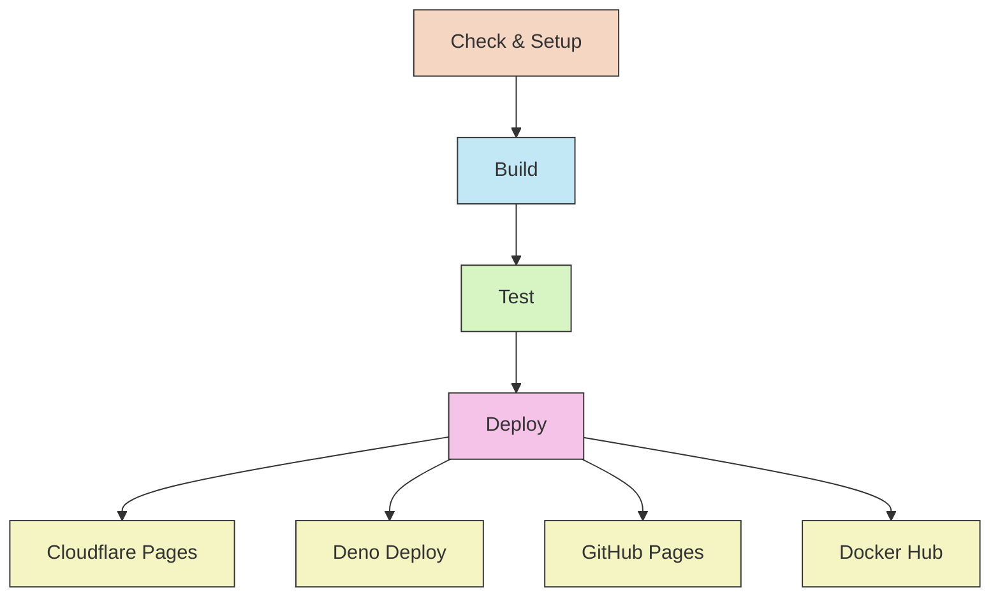

# CI/CD Implementation

### Continuous Integration/Deployment for the Revista project
---

## Overview

This project uses GitHub Actions for its CI/CD pipeline, automating builds, testing, and deployments to multiple targets including Cloudflare, Deno Deploy, GitHub Pages, and Docker Hub.

## Workflow Architecture

The CI/CD pipeline consists of the following stages:



## Workflow File Structure

The primary workflow file is `.github/workflows/deploy.yml`, which orchestrates the entire process.

## Build Process

The build process is optimized for speed and reliability:

```yaml
jobs:
  build:
    runs-on: ubuntu-latest
    steps:
      - uses: actions/checkout@v4
      
      - name: Setup Bun
        uses: oven-sh/setup-bun@v1
        with:
          bun-version: latest
      
      - name: Cache dependencies
        uses: actions/cache@v3
        with:
          path: ~/.bun/install/cache
          key: ${{ runner.os }}-bun-${{ hashFiles('**/bun.lockb') }}
          restore-keys: ${{ runner.os }}-bun-
      
      - name: Install dependencies
        run: bun install --frozen-lockfile
      
      - name: Build site
        run: bun run build
        
      - name: Upload artifact
        uses: actions/upload-artifact@v3
        with:
          name: build-output
          path: dist/
```

Key optimizations:

1. **Bun Instead of Node**: Uses Bun for significantly faster installations and builds
2. **Dependency Caching**: Caches Bun's dependency cache to speed up subsequent builds
3. **Frozen Lockfile**: Ensures consistent dependencies across builds
4. **Artifact Generation**: Uploads the build output for use in subsequent jobs

## Testing

The testing phase ensures the build meets quality standards:

```yaml
test:
  needs: build
  runs-on: ubuntu-latest
  steps:
    - uses: actions/checkout@v4
    
    - name: Download build
      uses: actions/download-artifact@v3
      with:
        name: build-output
        path: dist
    
    - name: Validate HTML
      run: npx html-validate dist/**/*.html
    
    - name: Check for broken links
      run: npx hyperlink dist/index.html --skip-external
```

Tests include:
1. HTML validation for standards compliance
2. Internal link checking to prevent broken navigation

## Deployment Targets

### Cloudflare Pages

```yaml
deploy-cloudflare:
  needs: test
  runs-on: ubuntu-latest
  steps:
    - name: Download build
      uses: actions/download-artifact@v3
      with:
        name: build-output
        path: dist
    
    - name: Publish to Cloudflare Pages
      uses: cloudflare/wrangler-action@2.0.0
      with:
        apiToken: ${{ secrets.CLOUDFLARE_API_TOKEN }}
        accountId: ${{ secrets.CLOUDFLARE_ACCOUNT_ID }}
        command: pages publish dist --project-name=revista

    - name: Purge Cloudflare cache
      run: |
        curl -X POST "https://api.cloudflare.com/client/v4/zones/${{ secrets.CLOUDFLARE_ZONE_ID }}/purge_cache" \
        -H "Authorization: Bearer ${{ secrets.CLOUDFLARE_API_TOKEN }}" \
        -H "Content-Type: application/json" \
        --data '{"purge_everything":true}'
```

Key points:
1. Uses Cloudflare's Wrangler tool to upload the built site
2. Purges the CDN cache to ensure visitors see the latest content

### Deno Deploy

```yaml
deploy-deno:
  needs: test
  runs-on: ubuntu-latest
  steps:
    - name: Download build
      uses: actions/download-artifact@v3
      with:
        name: build-output
        path: dist
    
    - name: Deploy to Deno Deploy
      uses: denoland/deployctl@v1
      with:
        project: revista
        entrypoint: https://deno.land/std/http/file_server.ts
        root: dist
        token: ${{ secrets.DENO_DEPLOY_TOKEN }}
```

This provides a secondary deployment target using Deno's edge platform.

### GitHub Pages

```yaml
deploy-to-github-pages:
  needs: build-revista
  runs-on: ubuntu-latest
  permissions:
    contents: read
    pages: write
    id-token: write
  concurrency:
    group: "pages"
    cancel-in-progress: false
  environment:
    name: github-pages
    url: ${{ steps.deployment.outputs.page_url }}
  steps:
    - name: Download build artifacts
      uses: actions/download-artifact@v4
      with:
        name: dist
        path: dist

    - name: Setup Pages
      uses: actions/configure-pages@v5

    - name: Upload to GitHub Pages
      uses: actions/upload-pages-artifact@v3
      with:
        path: dist

    - name: Deploy to GitHub Pages
      id: deployment
      uses: actions/deploy-pages@v4
```

Key features:
1. Uses the official GitHub Pages Actions for deployment
2. Configures proper permissions for Pages write access and OIDC token
3. Sets up concurrency control to prevent conflicting deployments
4. Creates a `github-pages` environment with the deployment URL
5. Uses the latest GitHub Actions for Pages (v5, v3, v4 respectively)

### Docker Deployment

```yaml
deploy-docker:
  needs: test
  runs-on: ubuntu-latest
  steps:
    - uses: actions/checkout@v4
    
    - name: Download build
      uses: actions/download-artifact@v3
      with:
        name: build-output
        path: dist
    
    - name: Set up Docker Buildx
      uses: docker/setup-buildx-action@v2
    
    - name: Login to Docker Hub
      uses: docker/login-action@v2
      with:
        username: ${{ secrets.DOCKERHUB_USERNAME }}
        password: ${{ secrets.DOCKERHUB_TOKEN }}
    
    - name: Build and push
      uses: docker/build-push-action@v4
      with:
        context: .
        push: true
        platforms: linux/amd64,linux/arm64
        tags: erfianugrah/revista:latest
        cache-from: type=gha
        cache-to: type=gha,mode=max
```

Key aspects:
1. Multi-architecture build for broad compatibility
2. Build caching to speed up subsequent builds
3. Automatic tagging and pushing to Docker Hub

## Secret Management

The workflow uses GitHub Secrets for sensitive information:

- `CLOUDFLARE_API_TOKEN` - Authentication for Cloudflare API
- `CLOUDFLARE_ACCOUNT_ID` - Cloudflare account identifier
- `CLOUDFLARE_ZONE_ID` - Cloudflare zone for cache purging
- `DENO_DEPLOY_TOKEN` - Authentication for Deno Deploy
- `DOCKERHUB_USERNAME` - Docker Hub account
- `DOCKERHUB_TOKEN` - Authentication for Docker Hub

Note: GitHub Pages deployment doesn't require additional secrets as it uses GitHub's built-in OIDC authentication with the `id-token: write` permission.

## Workflow Triggers

The workflow runs automatically on:

```yaml
on:
  push:
    branches: [ main ]
  pull_request:
    branches: [ main ]
  schedule:
    - cron: '0 0 * * 0' # Weekly builds for freshness
```

This ensures:
1. Automatic deployment when code is merged to main
2. Preview builds for pull requests
3. Regular rebuilds to keep dependencies current

## Retry Logic and Error Handling

The workflow includes retry logic for transient errors:

```yaml
- name: Install dependencies
  uses: nick-fields/retry@v2
  with:
    timeout_minutes: 10
    max_attempts: 3
    command: bun install --frozen-lockfile
```

This improves reliability by automatically retrying operations that might fail due to temporary issues.

## Performance Considerations

The CI/CD pipeline is optimized for speed:

1. Parallel deployments to multiple targets (Cloudflare, Deno, GitHub Pages, Docker)
2. Artifact sharing between jobs to avoid rebuilding
3. Caching of dependencies and Docker layers
4. Use of Bun instead of npm for faster installation and building
5. Concurrent deployment jobs that run simultaneously for faster overall pipeline execution

Typical build and deploy times:
- Full pipeline execution: ~4-6 minutes
- Build job: ~1-2 minutes
- Each deployment job: ~1-2 minutes
- GitHub Pages deployment: ~1-2 minutes (includes artifact upload and Pages deployment)