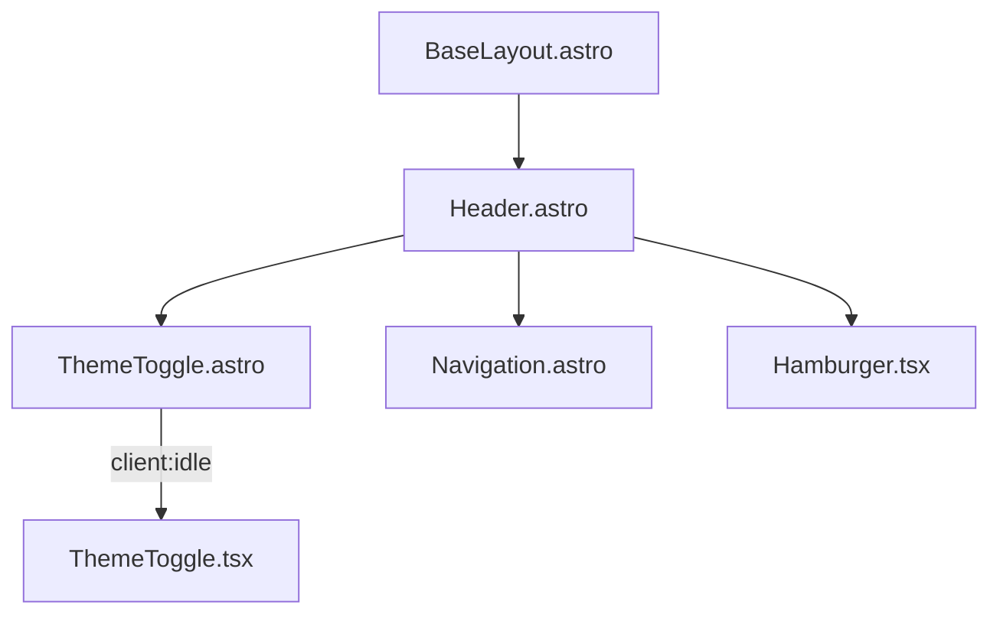
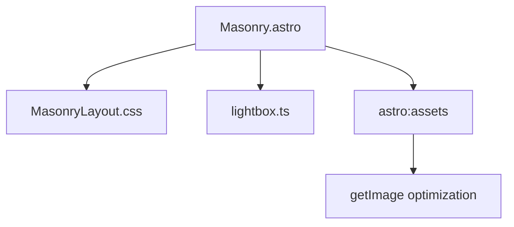
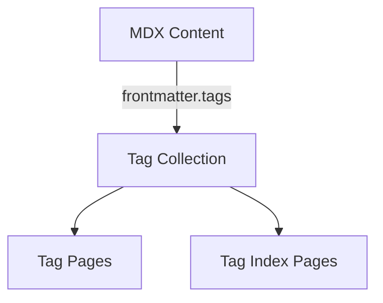

# Architecture Documentation

### Technical architecture of the Revista project

---

## Component Architecture

### React + Astro Integration

This project uses a combination of Astro components (`.astro` files) and React components (`.tsx` files) to create a performant, interactive website. Here's how they work together:



### Key Integration Points

1. **ThemeToggle Component** (split architecture):
   - **ThemeToggle.astro**: Lightweight wrapper that imports and renders the React component with `client:idle`
   - **ThemeToggle.tsx**: React component with CSS transitions for sun/moon animations. Watches for `class` attribute changes via `MutationObserver` and dispatches a `theme-toggle` custom event on click.
   - **theme.ts**: Shared module that handles the actual theme logic - reads/writes `localStorage`, toggles the `dark` class on `<html>`, and listens for both the `theme-toggle` event and `astro:after-swap` (for View Transitions).

```astro
---
import ThemeToggle from "./ThemeToggle";
---

<!-- ThemeToggle.astro -->
<ThemeToggle client:idle />
```

```tsx
// ThemeToggle.tsx — React handles UI, theme.ts handles state
const toggleTheme = () => {
  window.dispatchEvent(new Event("theme-toggle"));
};

// MutationObserver watches for class changes on <html>
// to keep React's isDark state in sync with theme.ts
```

```typescript
// theme.ts — single source of truth for theme state
export function initTheme(): void {
  applyTheme(getThemePreference());
  window.addEventListener("theme-toggle", toggleTheme);
  document.addEventListener("astro:after-swap", () => {
    applyTheme(getThemePreference());
  });
}
```

2. **State Management**:
   - `theme.ts` owns the state (localStorage + DOM class)
   - React component is a pure UI layer that dispatches events
   - `MutationObserver` keeps React in sync without tight coupling
   - `astro:after-swap` re-applies theme after View Transitions body swap

## Masonry Image Grid Implementation

The Masonry layout is a key visual feature of the site, implemented with CSS Grid rather than JavaScript-based libraries for better performance.

### Technical Implementation



### CSS Grid Configuration

```css
/* Key aspects of the Masonry layout */
.masonry {
  display: grid;
  grid-template-columns: repeat(auto-fill, minmax(200px, 1fr));
  grid-gap: 16px;
  grid-auto-flow: dense;
}

/* Variable sizing for visual interest */
.image-container:nth-child(3n) {
  grid-row: span 2; /* Every 3rd image spans 2 rows */
}

.image-container:nth-child(4n) {
  grid-column: span 2; /* Every 4th image spans 2 columns */
}

/* Responsive adjustments */
@media (max-width: 768px) {
  .masonry {
    grid-template-columns: repeat(auto-fill, minmax(150px, 1fr));
  }

  /* Reset spanning on smaller screens */
  .image-container:nth-child(3n),
  .image-container:nth-child(4n) {
    grid-row: auto;
    grid-column: auto;
  }
}
```

### Image Processing Pipeline

1. **Image Collection**: Images are specified in MDX frontmatter
2. **Optimization**: The `getImage` function from `astro:assets` processes each image:
   - Converts to AVIF format for better compression
   - Sets loading="lazy" for performance
   - Handles proper width/height attributes for CLS prevention
3. **Rendering**: Images are placed in the grid with CSS handling the layout
4. **Lightbox Integration**: A custom lightbox is attached for fullscreen viewing

## Custom Tailwind Configuration

The site uses a highly customized Tailwind configuration with specific breakpoints optimized for photography viewing.

### Custom Breakpoints

```javascript
screens: {
  "sm": "800px",  // Standard laptops
  "md": "1200px", // Larger laptops/small desktops
  "lg": "1900px", // Standard desktop monitors
  "xl": "2500px", // Large/high-res monitors
  "2xl": "3800px", // Ultra-wide displays
},
```

These breakpoints were specifically chosen based on:

1. Common display sizes for photography viewing
2. Optimal image grid layouts at different widths
3. Text readability considerations

### Custom Utilities

```javascript
objectPosition: {
  "top-33": "center top 33.33%",
  "top-50": "center top 50%",
},
backgroundPosition: {
  "center-33": "center 33.33%",
},
backgroundSize: {
  "size-66": "100% 66.67%",
}
```

These custom utilities provide precise control over image positioning and cropping, especially important for hero images and featured content where art direction is critical.

## Content Schema and Validation

### CollectionName Type

`src/scripts/collections.ts` exports a `CollectionName` type — a union of all content collection keys (`"muses" | "short_form" | "long_form" | "zeitweilig" | "authors" | "cv"`). This type is used throughout layouts and pages wherever `getCollection()` is called with a dynamic collection name, because Astro's generated types require a literal union member, not a plain `string`.

### MDX remarkPlugins Behavior

When `mdx()` specifies its own `remarkPlugins`, it **replaces** (not merges with) the base `markdown.remarkPlugins`. Because all content in this project is `.mdx`, the MDX integration's `remarkPlugins` array must include every remark plugin that content depends on (`remarkGfm`, `remarkMath`, `remarkReadingTime`).

### Schema Definition Pattern

All content is validated using Zod schemas with the following pattern:

```typescript
// Shared base schema — all collections use this
const baseSchema = z.object({
  title: z.string(),
  tags: z.array(z.string()),
  author: z.string(),
  description: z.string(),
  image: z
    .object({
      src: z.string(),
      alt: z.string(),
      positionx: z.string().optional(),
      positiony: z.string().optional(),
    })
    .optional(),
  pubDate: z.coerce.date(),
  updatedDate: z.coerce.date().optional(),
});

const muses = defineCollection({
  loader: glob({ pattern: "**\/[^_]*.mdx", base: "./src/content/muses" }),
  schema: baseSchema,
});

// CV extends the base with professional fields
const cv = defineCollection({
  loader: glob({ pattern: "**\/[^_]*.mdx", base: "./src/content/cv" }),
  schema: baseSchema.extend({ fullName: z.string().optional() /* ... */ }),
});
```

### Glob Pattern Selection

The `loader: glob({ pattern: "**\/[^_]*.mdx", base: "./src/content/muses" })` configuration:

1. `**\/` - Recursively searches all subdirectories
2. `[^_]*` - Ignores files that start with underscore (draft content)
3. `.mdx` - Only selects MDX files
4. `base: "./src/content/muses"` - Sets the root directory for the collection

This provides a way to:

- Organize content in subdirectories (e.g., by year, category)
- Keep draft content in the same directory but excluded from builds
- Apply consistent schemas to all content in a collection

## Image Optimization Strategy

The project uses a multi-layered approach to image optimization:

1. **Server-side optimization** via `astro:assets`:
   - Format conversion to AVIF/WebP
   - Responsive sizing
   - Proper metadata

2. **CDN integration** for external assets:

   ```javascript
   // astro.config.mjs
   image: {
     domains: ["erfianugrah.com", "image.erfi.io"],
     service: {
       entrypoint: "astro/assets/services/sharp",
       config: {
         limitInputPixels: false,
       },
     },
   },
   ```

3. **Loading optimizations**:
   - `loading="lazy"` for below-the-fold images
   - Proper sizing attributes to prevent layout shifts
   - Prefetching of critical images

## Search Implementation

The site uses Pagefind for search functionality, integrated as follows:

1. **Build-time indexing**: Pagefind runs as a post-build step to generate search indices

   ```json
   "scripts": {
     "postbuild": "pagefind --site dist"
   }
   ```

2. **Search UI**: The Pagefind component loads the search interface dynamically

3. **Integration**: Search results link directly to content pages

## Tag System Architecture



The tag system works as follows:

1. **Tag Definition**: Each content piece includes tags in its frontmatter

   ```yaml
   ---
   title: "Example Post"
   tags: ["photography", "urban", "monochrome"]
   ---
   ```

2. **Tag Extraction**: During build, Astro extracts all unique tags

   ```javascript
   export async function getStaticPaths() {
     const posts = await getCollection("muses");
     const tags = [...new Set(posts.flatMap((post) => post.data.tags))].sort();

     return tags.map((tag) => ({
       params: { tag },
       props: {
         posts: posts.filter((post) => post.data.tags.includes(tag)),
         tag,
       },
     }));
   }
   ```

3. **Route Generation**: Creates dynamic routes for each tag
   - `/muses/tags/[tag].astro` → `/muses/tags/monochrome`
   - `/long_form/tags/[tag].astro` → `/long_form/tags/travel`

4. **Content Association**: Each tag page displays all content with that tag

This architecture allows for:

- Cross-collection tagging
- Automatic tag page generation
- Consistent tag URLs across the site
